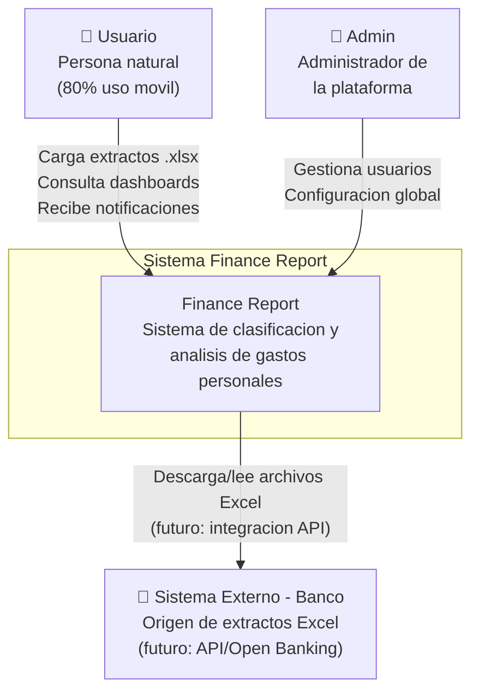
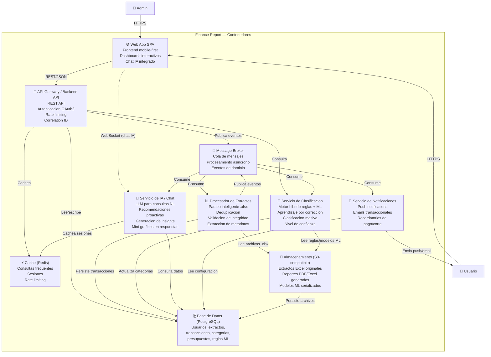

# Arquitectura del Sistema Finance Report

> **Ultima actualizacion**: 2026-06-02
> **Version**: 1.2.0 (ADRs 001-008 aceptados, ADR-009 formaliza el stack tecnologico, validacion post-design completada)
> **Fase**: architect (validacion) — stack validado, ADRs formalizados
> **Siguiente fase**: scaffold (generacion de codigo base)

---

## 1. Proposito y alcance

### Proposito

Finance Report es una aplicacion de clasificacion y analisis de gastos personales que procesa extractos bancarios mensuales en formato Excel (.xlsx), clasifica transacciones mediante un motor hibrido (reglas + ML), y presenta dashboards con analisis financiero detallado. El sistema incluye un asistente financiero con IA, deteccion de malos habitos, y traduccion colaborativa de comercios.

### Alcance

- **Incluye**: carga/parseo de extractos Excel multi-banco, clasificacion hibrida de transacciones, dashboard con 7 tipos de visualizaciones, deteccion de 8 malos habitos financieros, presupuestos/metas, historial/comparativas, notificaciones, asistente IA con chat, traduccion de comercios, multi-moneda inteligente, exportacion PDF/Excel.
- **Excluye**: integracion directa con APIs bancarias (Open Banking) en la version inicial — se contempla como roadm ap futuro.
- **Usuarios objetivo**: persona natural, consumo personal, 80% de uso desde movil.

### Objetivos de arquitectura

| Calidad | Objetivo | Metrica |
|---------|----------|---------|
| Disponibilidad | Alta disponibilidad en picos de cierre | 99.5% uptime |
| Rendimiento | Carga rapida de extractos y dashboards | < 3s extracto, < 1s dashboard, < 500ms clasificacion |
| Escalabilidad | Soportar picos primeros 5 dias del mes | Arquitectura cloud-native con auto-scaling |
| Seguridad | Proteccion de datos financieros sensibles | AES-256 en reposo, TLS 1.3 en transito, OAuth2 + 2FA |
| Portabilidad | Soportar multiples bancos y formatos | Parser tolerante a variaciones, API de importacion CSV/PDF |
| Usabilidad | Experiencia mobile-first | 80% consultas desde movil, UI responsive adaptativa |

---

## 2. Diagrama de contexto (C4 — Nivel 1)



### Descripcion de relaciones

| Actor | Direccion | Interaccion | Protocolo |
|-------|-----------|-------------|-----------|
| Usuario | → Sistema | Carga de extractos Excel, consulta dashboards, chat IA, configuracion de categorias/presupuestos | HTTPS (REST API) |
| Usuario | ← Sistema | Notificaciones push/email, respuestas del asistente IA | Web Push, SMTP |
| Admin | → Sistema | Gestion de usuarios, configuracion global de la plataforma | HTTPS (REST API) |
| Banco | ← Sistema | Lectura de archivos Excel descargados por el usuario; futuro: API Open Banking | SFTP/API (futuro) |

---

## 3. Diagrama de contenedores (C4 — Nivel 2)



### Descripcion de contenedores

| Contenedor | Responsabilidad | Tipo |
|------------|----------------|------|
| **Web App SPA** | Frontend mobile-first con dashboards interactivos, carga de extractos, chat IA, configuracion de categorias | Aplicacion web |
| **API Gateway / Backend API** | REST API con OAuth2, rate limiting, correlation ID, orquestacion de casos de uso | Aplicacion backend |
| **Base de Datos** | PostgreSQL con integridad referencial, datos financieros, reglas de clasificacion, historial | Base de datos relacional |
| **Cache** | Redis para consultas frecuentes de dashboard, sesiones, rate limiting | Cache distribuido |
| **Message Broker** | Cola de mensajes para procesamiento asincrono de extractos y eventos de dominio | Mensajeria |
| **Procesador de Extractos** | Worker que parsea archivos Excel, extrae metadatos, valida integridad, deduplica | Worker / Servicio |
| **Servicio de Clasificacion** | Motor hibrido reglas deterministicas + ML, aprendizaje por correccion del usuario | Worker / Servicio |
| **Servicio de IA / Chat** | LLM para consultas en lenguaje natural, recomendaciones proactivas, generacion de insights | Servicio |
| **Servicio de Notificaciones** | Envio de push notifications, emails transaccionales, recordatorios programados | Worker / Servicio |
| **Almacenamiento** | Almacenamiento de objetos para extractos Excel, reportes generados, y modelos ML | Object Storage |

---

## 4. Topologia de servicios

### 4.1 Web App SPA

- **Framework**: frontend SPA mobile-first (PENDIENTE — definir en fase design)
- **Responsabilidades**:
  - Interfaz de usuario responsive (mobile-first, 80% trafico movil)
  - Dashboard con 7 tipos de visualizaciones (KPI cards, donut, barras apiladas, linea, treemap, proyeccion cuotas, heatmap)
  - Pantalla de carga de extractos con feedback en tiempo real (progreso de procesamiento via WebSocket/SSE)
  - Chat integrado con el asistente IA (streaming de respuestas)
  - Gestion de categorias, subcategorias, presupuestos y metas
  - Simulador "que pasaria si" con sliders interactivos
  - Exportacion de reportes PDF/Excel
  - Onboarding interactivo con extracto de ejemplo precargado

### 4.2 API Gateway / Backend API

- **Patron**: API-first, REST con versionado (v1, v2...)
- **Responsabilidades**:
  - Autenticacion OAuth2 (Google/Microsoft) + 2FA TOTP
  - Autorizacion basada en roles (Usuario, Admin)
  - Rate limiting por usuario
  - Correlation ID tracing en cada request
  - Orquestacion de casos de uso (CQRS — commands y queries separados)
  - Gestion de usuarios y preferencias
  - Endpoints REST para dashboards, transacciones, categorias, presupuestos, metas, notificaciones
  - Publicacion de eventos de dominio al Message Broker
  - Health checks: `/health` (liveness), `/health/ready` (readiness)

### 4.3 Procesador de Extractos

- **Tipo**: Worker asincrono (consumidor de cola de mensajes)
- **Responsabilidades**:
  - Parseo inteligente de archivos Excel (.xlsx) con tolerancia a variaciones de formato multi-banco
  - Deteccion automatica de estructura: metadatos, encabezados, tabla de transacciones
  - Asociacion de sub-filas "VR MONEDA ORIG" a su transaccion padre (RF01.1)
  - Deduplicacion de extractos por periodo + tarjeta (BN-01)
  - Validacion de integridad financiera (suma de movimientos vs. pago total)
  - Extraccion de metadatos: periodo, fechas de corte/pago, cupos, tasas de interes
  - Deteccion de compras a cuotas (1/N) vs. contado (1/1)
  - Publicacion de evento `ExtractoProcesado` con las transacciones extraidas

### 4.4 Servicio de Clasificacion

- **Tipo**: Worker asincrono + API de consulta
- **Responsabilidades**:
  - Motor de reglas deterministicas basado en palabras clave y expresiones regulares por categoria
  - Motor ML para aprendizaje por correccion: cuando el usuario recategoriza, el modelo aprende
  - Calculo de nivel de confianza (alto >90%, medio 70-90%, bajo <70%)
  - Presentacion de transacciones de confianza baja al usuario para confirmacion en lote
  - Clasificacion masiva (seleccion multiple + asignar categoria)
  - Subcategorias personalizables por usuario (BN-09 — propagacion retroactiva a transacciones pasadas)
  - Traduccion de nombres de comercio (colaborativo, base de conocimiento compartida)
  - Soporte multi-moneda: deteccion de moneda extranjera, conversion a COP, visualizacion dual

### 4.5 Servicio de IA / Chat

- **Tipo**: Servicio con API REST + WebSocket
- **Responsabilidades**:
  - Procesamiento de consultas en lenguaje natural (espanol inicialmente, preparado para i18n)
  - Generacion de consultas SQL / agregaciones a partir de lenguaje natural
  - Streaming de respuestas via WebSocket/SSE
  - Recomendaciones proactivas basadas en deteccion de patrones
  - Generacion de mini-graficos en las respuestas (datos + visualizacion)
  - Contexto de conversacion persistente por sesion de usuario
  - Integracion con LLM externo (PENDIENTE — proveedor a definir en design)

### 4.6 Servicio de Notificaciones

- **Tipo**: Worker asincrono (consumidor de eventos)
- **Responsabilidades**:
  - Recordatorio de pago: 3 dias antes de fecha limite
  - Alerta de transaccion grande (> umbral configurable)
  - Resumen semanal (cada lunes 8am)
  - Alerta de presupuesto al 80% y 100%
  - Recordatorio de corte: 2 dias antes
  - Alerta de mal habito financiero detectado
  - Resumen mensual (dia del corte)
  - Canales: Push notification (Web Push API) + Email (SMTP)
  - Programacion de notificaciones recurrentes (cron jobs)

### 4.7 Base de Datos (PostgreSQL)

- **Responsabilidades**:
  - Esquema normalizado con integridad referencial
  - Datos financieros con precision decimal (NUMERIC)
  - Reglas de clasificacion y modelos ML (features, pesos)
  - Historial completo de transacciones por periodo
  - Preferencias de usuario (categorias personalizadas, presupuestos, metas)
  - Traducciones de comercios (base colaborativa)
  - Datos de autenticacion y sesiones

### 4.8 Cache (Redis)

- **Responsabilidades**:
  - Cache de consultas de dashboard (TTL: 60s para datos del mes actual)
  - Sesiones de usuario
  - Rate limiting (token bucket por usuario)
  - Cache de traducciones de comercios
  - Cache de tasas de cambio historicas

### 4.9 Message Broker

- **Responsabilidades**:
  - Cola de procesamiento de extractos (prioridad alta: usuario esperando)
  - Cola de clasificacion automatica
  - Eventos de dominio: `ExtractoCargado`, `ExtractoProcesado`, `TransaccionClasificada`, `CategoriaCorregida`, `PresupuestoAlcanzado`, `HabitoDetectado`, `RecordatorioPendiente`
  - Desacoplamiento entre servicios
  - Garantia de entrega: at-least-once con idempotencia en consumidores

### 4.10 Almacenamiento (Object Storage)

- **Responsabilidades**:
  - Archivos Excel originales cargados por el usuario (conservar para auditoria)
  - Reportes PDF/Excel generados bajo demanda (con TTL de expiracion)
  - Modelos ML serializados (reglas aprendidas, embeddings de comercios)

---

## 5. Stack tecnologico

> **Estado**: DEFINIDO — Fase `design` completada. Eleccion confirmada por el usuario.
> **ADR**: ADR-009 formaliza la decision del stack tecnologico.

### 5.1 Tabla de stack

| Capa | Tecnologia | Version | Justificacion |
|------|-----------|---------|---------------|
| Lenguaje Backend | Python | 3.12+ | Mejor ecosistema para parseo de Excel (openpyxl, pandas) y ML (scikit-learn, sentence-transformers), los dos diferenciadores clave del producto. `Decimal` nativo para precision financiera. |
| Framework API | FastAPI | latest | Alto rendimiento (async/uvicorn), OpenAPI automatico, validacion Pydantic v2. Tipos compartidos via generacion TypeScript desde el contrato OpenAPI. |
| Lenguaje Frontend | TypeScript | 5.x | Tipado estatico para el frontend SPA. Ecosistema React maduro para 7 visualizaciones de dashboard mobile-first. |
| Framework Frontend | Next.js (App Router) | 14+ | Full-stack React con SSR/SSG para rendimiento de dashboards. PWA-ready. Optimizado para Vercel (despliegue gratuito). App Router para layouts anidados y streaming. |
| ORM | SQLAlchemy 2.0 + Alembic | latest | ORM async maduro con type hints. Migraciones declarativas. Soporte nativo para NUMERIC (precision financiera) y JSONB. |
| Base de datos | PostgreSQL (Supabase) | 16 | Integridad referencial ACID para datos financieros. NUMERIC para montos exactos. JSONB para metadatos variables por banco. Supabase: 500MB gratis, managed, con Row Level Security. |
| Cache | Redis (Upstash) | 7 | 256MB gratis, Redis 7 managed. Cache de dashboards (TTL 60s), sesiones, rate limiting, traducciones de comercios. |
| Mensajeria | RabbitMQ | 3.13 | Auto-gestionado en Oracle VM. Colas separadas para extractos, clasificacion y notificaciones. DLQ para mensajes fallidos. At-least-once con idempotencia. |
| LLM / IA | Google Gemini 1.5 Flash | latest | Tier gratuito: 1,500 req/dia. Excelente espanol, function calling robusto, SDK Python first-class. Streaming nativo para chat IA. Alternativa: Groq (Llama 3.3 70B) como fallback. |
| Excel Parsing | openpyxl + pandas | latest | openpyxl para lectura de .xlsx con estructura compleja multi-seccion. pandas para transformacion, validacion y deteccion de patrones en datos tabulares. |
| ML / Clasificacion | scikit-learn + sentence-transformers | latest | scikit-learn para modelos de clasificacion (TF-IDF, RandomForest). sentence-transformers para embeddings semanticos de nombres de comercio. |
| Testing Backend | pytest | latest | Fixtures, parametrizacion, async support (pytest-asyncio). Plugins para PostgreSQL (pytest-postgresql) y Redis (fakeredis). |
| Testing Frontend | Vitest | latest | Nativo ESM, rapido, integrado con el ecosistema Vite/Next.js. Mocking integrado sin configuracion adicional. |
| Logging Backend | structlog | latest | Logging estructurado JSON. Contexto inmutable (correlation_id, user_id). Integracion con OpenTelemetry para tracing distribuido. |
| Logging Frontend | Winston | latest | Structured logging en el frontend. Transportes para consola (desarrollo) y HTTP (produccion → Grafana Loki). |
| Contenedores | Docker | latest | Multi-stage builds. Imagenes separadas: FastAPI, Next.js, workers (ExtractProc, ClassSvc, NotifSvc), RabbitMQ. |
| Orquestacion | Kubernetes (Oracle OKE) | latest | Managed K8s gratuito sobre nodos ARM Ampere A1. Auto-scaling horizontal de workers en picos dia 1-5. Namespaces por entorno. |
| CI/CD | GitHub Actions | — | 2,000 min/mes gratis. Workflows: test (PR), build+publish Docker images, deploy a Vercel (frontend) y Oracle OKE (backend). |
| Observabilidad | OpenTelemetry + Grafana Cloud | latest | Trazas distribuidas desde API Gateway hasta workers. Metricas de negocio (extractos/dia, precision clasificacion) y tecnicas (latencia, colas). Grafana Cloud: 10K metricas gratis. |
| Almacenamiento | Cloudflare R2 (S3-compatible) | — | 10GB gratis, sin egress fees. Compatible con API S3 (boto3). Almacena extractos Excel originales, reportes PDF/Excel generados, modelos ML serializados. |
| Despliegue Backend | Oracle Cloud VM Ampere A1 | Always Free | 4 OCPU ARM, 24GB RAM, 200GB disco. Corre FastAPI + 3 workers Python + RabbitMQ + Ollama (fallback IA) simultaneamente. Sin cold starts. |
| Despliegue Frontend | Vercel | Hobby | 100GB bandwidth, optimizado para Next.js. Preview deployments por rama Git. SSL automatico. Edge Network global. |

### 5.2 Plataformas de despliegue gratuitas

| Componente | Plataforma | Plan | Recurso gratuito |
|------------|-----------|------|-----------------|
| Frontend (Next.js) | Vercel | Hobby | 100GB bandwidth/mes, deploy automatico desde GitHub |
| Backend (FastAPI) | Oracle Cloud VM Ampere A1 | Always Free | 4 OCPU ARM, 24GB RAM, 200GB disco |
| Base de datos | Supabase | Free | 500MB, 2 proyectos, 2GB transferencia |
| Cache | Upstash Redis | Free | 256MB, 10K comandos/dia |
| Mensajeria | RabbitMQ (Docker) | Auto-gestionado | Dentro de la VM Oracle (sin limites) |
| Object Storage | Cloudflare R2 | Free | 10GB, 10M req/mes, sin egress fees |
| Orquestacion | Oracle OKE | Free | Managed K8s sobre nodos ARM gratuitos |
| Observabilidad | Grafana Cloud | Free | 10K metricas, 50GB logs, 14 dias retencion |
| CI/CD | GitHub Actions | Free | 2,000 min/mes repos privados |
| LLM | Google Gemini 1.5 Flash | Free | 1,500 req/dia, 1M tokens/min |

### 5.3 LLM: Estrategia multi-proveedor

| Prioridad | Proveedor | Modelo | Rol | Limite gratuito |
|-----------|-----------|--------|-----|-----------------|
| **Primario** | Google Gemini | Gemini 1.5 Flash | Chat IA, function calling, recomendaciones proactivas | 1,500 req/dia, 15 RPM |
| **Fallback** | Groq | Llama 3.3 70B | Alternativa si Gemini no disponible o rate-limit alcanzado | Rate limit dinamico (~30 req/min) |
| **Offline** | Ollama (local) | Llama 3.1 8B | Modo offline en la VM Oracle. Clasificacion de comercios sin API externa | Ilimitado (usa RAM de la VM) |

---

## 6. ADR — Architecture Decision Records

### ADR-001: Arquitectura modular — Clean Architecture con separacion en capas

**Estado**: Aceptado
**Fecha**: 2026-06-02
**Contexto**:

El sistema Finance Report tiene requerimientos funcionales complejos (10 RFs, 7 visualizaciones, 8 detectores de habitos, asistente IA) y requerimientos no funcionales exigentes (99.5% uptime, < 3s carga, < 1s dashboard). Se necesita una arquitectura que soporte evolucion independiente de componentes, testabilidad, y reemplazo de infraestructura sin afectar la logica de negocio.

**Decision**:

Adoptar Clean Architecture con separacion estricta en cuatro capas:

1. **Dominio**: Entidades, value objects, eventos de dominio, interfaces de repositorio. Sin dependencias externas.
2. **Aplicacion**: Casos de uso (commands/queries CQRS), DTOs, validadores. Depende solo de Dominio.
3. **Infraestructura**: Implementaciones de repositorios, ORM, servicios externos (mensajeria, cache, storage, IA). Depende de Dominio y Aplicacion.
4. **Presentacion**: API REST (backend) y SPA (frontend). Depende de Aplicacion para orquestar casos de uso.

La regla de dependencia es: las capas internas no conocen las externas. Dominio es el centro.

**Consecuencias**:

- **Positivas**:
  - La logica de negocio (clasificacion, calculo de score, deteccion de habitos) es independiente del framework y la base de datos
  - Facilita pruebas unitarias del dominio sin infraestructura
  - Permite cambiar la base de datos, el ORM o el framework web sin reescribir la logica de negocio
  - Soporta migracion gradual a microservicios si se requiere en el futuro
- **Negativas**:
  - Mayor cantidad de proyectos/archivos iniciales (overhead de estructura)
  - Mapeo entre capas (entidades de dominio ↔ DTOs) requiere codigo adicional
  - Curva de aprendizaje para desarrolladores no familiarizados con Clean Architecture

---

### ADR-002: Arquitectura cloud-native con procesamiento serverless para picos de uso

**Estado**: Aceptado
**Fecha**: 2026-06-02
**Contexto**:

Los usuarios cargan sus extractos principalmente durante los primeros 5 dias de cada mes (cierre de tarjeta). El resto del mes el trafico es significativamente menor (consultas de dashboard). Se necesita una arquitectura que escale eficientemente en estos picos sin incurrir en costos de infraestructura ociosa el resto del mes.

**Decision**:

Adoptar una arquitectura cloud-native con contenedores y orquestacion que permita:

1. **Auto-scaling horizontal** de workers de procesamiento (extractos, clasificacion) basado en profundidad de la cola de mensajes
2. **Workers desacoplados** via message broker: el Procesador de Extractos, Clasificador, y Notificador son servicios independientes que escalan individualmente
3. **API Backend** con escalado basado en CPU/requests por segundo
4. **Base de datos** con connection pooling y read replicas si es necesario para consultas de dashboard
5. Los workers serverless (o pods/CaaS) se crean bajo demanda durante los picos del dia 1-5 y se reducen a minima capacidad el resto del mes

**Consecuencias**:

- **Positivas**:
  - Costos operativos proporcionales al uso real
  - El sistema no se degrada durante los picos del dia 1-5
  - Cada tipo de worker escala independientemente segun su carga
  - Facilita la adicion de nuevos bancos/formatos sin afectar otros servicios
- **Negativas**:
  - Complejidad operacional: se requiere monitoreo de colas, cold starts, timeouts
  - Los workers serverless tienen latencia de arranque (cold start) que podria afectar la experiencia del usuario si no se mitiga con keep-warm
  - La base de datos es un punto de contention — requiere connection pooling cuidadoso y posiblemente read replicas

---

### ADR-003: Motor de clasificacion hibrido (reglas deterministicas + ML para aprendizaje por correccion)

**Estado**: Aceptado
**Fecha**: 2026-06-02
**Contexto**:

El sistema debe clasificar ~70 transacciones por extracto en 14 categorias predefinidas. Los nombres de comercio en extractos colombianos son poco amigables (ej. "DLO*DIDI FOOD CO PAYIN") y varian entre bancos. Se requiere alta precision inicial (reglas) con capacidad de mejora continua (aprendizaje por correccion del usuario). La clasificacion debe ejecutarse en < 500ms para ~70 transacciones.

**Decision**:

Implementar un motor de clasificacion en dos fases:

1. **Fase 1 — Reglas deterministicas**: Pipeline de clasificacion basado en:
   - Diccionario de palabras clave por categoria (ej. "UBER", "DIDI" → Transporte)
   - Expresiones regulares predefinidas para patrones comunes (ej. "DLO\\*DIDI FOOD" → Alimentacion)
   - Base de conocimiento de traducciones de comercios (colaborativa)
   - Heuristicas por monto y tipo de transaccion (abonos → Ingresos, comisiones → Financieros)
   - Nivel de confianza alto (>90%) cuando hay match exacto de comercio previamente clasificado

2. **Fase 2 — ML por correccion**: Cuando el usuario recategoriza una transaccion:
   - El sistema registra el mapeo `comercio → categoria_corregida`
   - Para futuras ocurrencias del mismo comercio (o comercios con nombre similar), usa el aprendizaje previo
   - Embeddings de texto del nombre del comercio para sugerir categorias a comercios nuevos similares a otros ya clasificados
   - El modelo se reentrena periodicamente con todas las correcciones acumuladas

**Consecuencias**:

- **Positivas**:
  - Alta precision desde el primer uso (reglas cubren los casos mas comunes del extracto real)
  - Mejora continua sin intervencion manual: cada correccion del usuario enriquece el modelo
  - Baja latencia: la fase de reglas es O(n) deterministico, la fase ML es consulta ligera
  - Transparencia: el usuario puede ver por que se asigno una categoria (regla vs. aprendizaje)
- **Negativas**:
  - El cold start del modelo ML requiere que el usuario corrija algunas transacciones iniciales
  - Mantener dos motores (reglas + ML) implica dos fuentes de verdad que deben coordinarse
  - Las reglas necesitan actualizacion periodica para nuevos comercios/patrones

---

### ADR-004: Mobile-first responsive design (80% uso movil)

**Estado**: Aceptado
**Fecha**: 2026-06-02
**Contexto**:

El 80% de las consultas al sistema se realizaran desde dispositivos moviles (celulares). El dashboard contiene 7 tipos de visualizaciones complejas (donut, barras apiladas, linea, treemap, proyeccion de cuotas, heatmap calendario, gauge de score) que deben ser usables en pantallas pequeñas. Ademas, la carga de extractos (subida de archivos Excel) debe ser fluida desde movil.

**Decision**:

Adoptar una estrategia de diseño mobile-first con los siguientes principios:

1. **Mobile-first CSS**: empezar diseñando para viewport de 320px y escalar progresivamente (breakpoints: 320, 480, 768, 1024, 1440)
2. **Componentes adaptativos**: cada visualizacion del dashboard tiene una version movil simplificada que prioriza la informacion mas relevante:
   - Donut → version reducida con top 3 categorias + "otros"
   - Barras apiladas → scroll horizontal con dias agregados por semana en movil
   - Heatmap → version trimestral en vez de anual en movil
   - Proyeccion de cuotas → lista vertical colapsable en vez de grafico horizontal completo
3. **Touch-first interactions**: todos los elementos interactivos (filtros, drill-down, sliders) diseñados para touch con tamaño minimo de 44x44px
4. **Carga progresiva de datos**: en movil se cargan primero KPIs criticos (total gastado, % cupo) y luego graficos secundarios
5. **Subida de archivos**: soporte para seleccionar archivos Excel desde almacenamiento local o cloud del dispositivo (Google Drive, iCloud)
6. **PWA-ready**: service workers para cache offline de dashboards consultados recientemente y notificaciones push

**Consecuencias**:

- **Positivas**:
  - Experiencia optima en el 80% de los casos de uso (movil)
  - Menor friccion para consultas rapidas ("¿cuanto llevo gastado este mes?")
  - Notificaciones push nativas en Android/iOS via PWA
- **Negativas**:
  - Complejidad adicional en el frontend (dos layouts por componente)
  - Algunas visualizaciones pierden detalle en movil (trade-off consciente)
  - El testing debe cubrir multiples viewports y dispositivos

---

### ADR-005: Procesamiento asincrono de extractos via cola de mensajes

**Estado**: Aceptado
**Fecha**: 2026-06-02
**Contexto**:

La carga de un extracto implica: (1) subir el archivo Excel, (2) parsear su estructura (que puede ser compleja: multiples secciones, sub-filas de moneda, separadores), (3) extraer metadatos, (4) validar integridad financiera, (5) clasificar ~70 transacciones. Si todo esto se ejecuta sincronicamente en el request HTTP del usuario, se corre el riesgo de timeout (> 30s) y mala experiencia. El requerimiento RF01 exige < 3 segundos para la carga completa.

**Decision**:

Implementar un flujo de procesamiento asincrono basado en eventos:

1. **Fase sincrona (< 500ms)**: El frontend sube el archivo Excel al API. El API:
   - Valida el formato (.xlsx) y tamaño maximo
   - Almacena el archivo en Object Storage
   - Registra el extracto en estado `PENDIENTE` en la base de datos
   - Publica el evento `ExtractoCargado` al Message Broker
   - Responde al usuario con un `extractId` y un endpoint de estado

2. **Fase asincrona**: El Procesador de Extractos (worker) consume el evento:
   - Lee el archivo desde Object Storage
   - Parseo inteligente del Excel
   - Validacion de integridad financiera
   - Publica `ExtractoProcesado` con las transacciones extraidas
   - El Servicio de Clasificacion consume y clasifica las transacciones
   - Actualiza el estado del extracto a `COMPLETADO` (o `ERROR` con detalle)

3. **Feedback al usuario**: El frontend sondea (polling con backoff) o recibe via WebSocket/SSE el progreso:
   - "Analizando archivo... 30%"
   - "Extrayendo transacciones... 60%"
   - "Clasificando gastos... 90%"
   - "¡Listo! 67 transacciones clasificadas"

**Consecuencias**:

- **Positivas**:
  - El request HTTP del usuario nunca excede 500ms (solo subida y registro)
  - El procesamiento pesado ocurre en background sin bloquear al usuario
  - Si el procesamiento falla, el sistema puede reintentar sin afectar al usuario
  - La cola de mensajes actua como buffer durante picos del dia 1-5
  - Facil de monitorear: profundidad de la cola = carga del sistema
- **Negativas**:
  - El usuario debe esperar (aunque con feedback visual de progreso)
  - Mayor complejidad: se requiere mecanismo de sondeo o push para notificar finalizacion
  - Si la cola se satura durante picos extremos, la latencia percibida aumenta
  - Se debe manejar el caso de que el usuario cierre la sesion antes de que termine el procesamiento

---

### ADR-006: API-first design — REST API consumida por frontend web y futura app movil

**Estado**: Aceptado
**Fecha**: 2026-06-02
**Contexto**:

El sistema tendra inicialmente un frontend web SPA, pero en el roadmap se contempla una app movil nativa. Ambas deben consumir la misma logica de negocio. Ademas, en el futuro podrian integrarse otros bancos via API (Open Banking). Se necesita una interfaz estable y versionada.

**Decision**:

Adoptar un enfoque API-first donde:

1. **El contrato API se diseña primero** (antes que el frontend) siguiendo OpenAPI 3.x
2. **Versionado en la URL**: `/api/v1/extractos`, `/api/v1/transacciones`, etc.
3. **RESTful**: recursos nombrados por sustantivo en plural, HTTP verbs semanticos (GET, POST, PUT, PATCH, DELETE)
4. **HATEOAS ligero**: cada respuesta incluye enlaces a acciones relacionadas (ej. transaccion incluye link a su extracto, a su categoria)
5. **Misma API para web y movil**: no hay endpoints especificos por cliente; las diferencias se manejan en la capa de presentacion
6. **Documentacion automatica**: Swagger UI / Redoc generado a partir del contrato OpenAPI
7. **Contract testing**: pruebas de contrato (Pact) entre API y frontend para garantizar compatibilidad

**Consecuencias**:

- **Positivas**:
  - El frontend web y la futura app movil comparten el mismo backend sin duplicacion
  - El contrato API documentado facilita integraciones futuras (Open Banking, otros bancos)
  - Versionado permite evolución sin romper clientes existentes
  - Facilita testing automatizado (los tests de integracion se escriben contra el contrato)
- **Negativas**:
  - Mayor rigidez inicial: cambios en el API requieren coordinacion con el equipo frontend
  - HATEOAS añade complejidad que puede no ser necesaria en una SPA que conoce los endpoints
  - El versionado introduce deuda tecnica si no se gestiona activamente la deprecacion de versiones antiguas

---

### ADR-007: Base de datos relacional (PostgreSQL) para integridad de datos financieros

**Estado**: Aceptado
**Fecha**: 2026-06-02
**Contexto**:

El sistema maneja datos financieros que requieren integridad absoluta: transacciones con montos exactos, relaciones entre extractos y transacciones, calculos de cuotas con intereses, presupuestos con limites precisos. Las reglas de negocio BN-01 a BN-10 implican restricciones de unicidad (un extracto por periodo), integridad referencial (transaccion pertenece a un extracto, cuotas pertenecen a una transaccion), y calculos financieros exactos (interes, saldo pendiente, costo total de cuotas).

**Decision**:

Usar PostgreSQL como base de datos principal con las siguientes caracteristicas:

1. **Tipo NUMERIC** para todos los montos financieros (evita errores de redondeo de FLOAT)
2. **Constraints de integridad**: UNIQUE (tarjeta_id, periodo_inicio, periodo_fin), CHECK (monto > 0 para gastos, NOT NULL en columnas requeridas)
3. **Foreign keys** entre extractos → transacciones → cuotas → categorias → usuarios
4. **Indices** para consultas frecuentes: fecha de transaccion, categoria_id, comercio (para busqueda), usuario_id + periodo
5. **JSONB** para datos semi-estructurados: metadatos del extracto que varian por banco, configuracion de reglas de clasificacion, features del modelo ML
6. **Row-Level Security** (opcional): si en el futuro se ofrece version multi-usuario empresarial
7. **Particionamiento** por usuario_id o año-mes para escalar cuando el historial crezca

**Consecuencias**:

- **Positivas**:
  - Integridad de datos garantizada por el motor de base de datos (no solo por la aplicacion)
  - ACID garantiza que una carga de extracto (transaccion + cuotas + metadatos) sea atomica
  - NUMERIC evita errores de redondeo que serian catastroficos en calculos financieros
  - JSONB da flexibilidad para datos variables sin perder la rigidez donde se necesita
  - Amplio ecosistema de herramientas: migraciones, backups, replicacion, monitoreo
- **Negativas**:
  - PostgreSQL requiere operacion y mantenimiento (a diferencia de alternativas serverless)
  - La necesidad de migraciones de esquema añade un paso en el despliegue
  - Menor flexibilidad que bases de datos NoSQL para datos no estructurados (mitigado con JSONB)

---

### ADR-008: Estrategia de branching Git Flow

**Estado**: Aceptado
**Fecha**: 2026-06-02
**Contexto**:

El proyecto se desarrolla incrementalmente con multiples features en paralelo. Se necesita una estrategia de branching que permita desarrollo aislado de features, releases estables, y hotfixes urgentes sin interferir con el desarrollo activo. El harness de desarrollo utiliza agentes especializados que trabajan en ramas independientes por feature.

**Decision**:

Adoptar Git Flow como estrategia de branching con la siguiente estructura:

1. **Ramas principales**:
   - `main`: codigo en produccion. Solo recibe merges desde `release/*` y `hotfix/*`.
   - `develop`: integracion continua. Recibe merges desde `feature/*` y `release/*`.

2. **Ramas de soporte**:
   - `feature/{id}-{slug}`: desarrollo de nuevas funcionalidades. Se crea desde `develop` y se mergea de vuelta a `develop` con `--no-ff`.
   - `release/{version}`: preparacion de release. Se crea desde `develop`, se mergea a `main` (con tag) y de vuelta a `develop`.
   - `hotfix/{version}`: correcciones urgentes en produccion. Se crea desde `main`, se mergea a `main` (con tag incrementado) y a `develop`.

3. **Convenciones de commit**: Conventional Commits (`feat:`, `fix:`, `refactor:`, `test:`, `docs:`, `chore:`, `ci:`)

4. **Integracion con harness**: El agente `features` gestiona la creacion y merge de ramas feature. Cada feature se desarrolla en su propia rama con TDD y BDD.

**Consecuencias**:

- **Positivas**:
  - Desarrollo paralelo sin interferencias entre features
  - Historial de git limpio y navegable (merges `--no-ff` preservan el contexto de la feature)
  - Releases estables con versionado semantico
  - Hotfixes rapidos sin bloquear el desarrollo en `develop`
  - Compatible con el harness de agentes (cada agente sabe en que rama trabajar)
- **Negativas**:
  - Mayor complejidad que trunk-based development para equipos pequeños
  - Los merges `--no-ff` generan commits de merge que pueden dificultar el blame
   - Requiere disciplina para mantener `develop` siempre estable y deployable

---

### ADR-009: Stack tecnologico

**Estado**: Aceptado
**Fecha**: 2026-06-02
**Contexto**:

El sistema Finance Report tiene requerimientos funcionales y no funcionales que demandan fortalezas en dos areas muy diferentes: (1) procesamiento de datos — parseo de Excel multi-banco, clasificacion ML, calculos financieros de precision — donde Python tiene el ecosistema mas maduro (openpyxl, pandas, scikit-learn, sentence-transformers, Decimal nativo); y (2) experiencia de usuario mobile-first — dashboard con 7 visualizaciones interactivas, PWA, chat IA con streaming SSE — donde TypeScript con Next.js ofrece SSR, SSG, y el ecosistema React mas completo para componentes de UI.

Se evaluaron tres opciones de stack ante el usuario, quien confirmo la Opcion B como la eleccion final.

**Decision**:

Adoptar un **stack hibrido Python + TypeScript**, donde cada lenguaje opera en su area de fortaleza:

**Backend (Python + FastAPI)**:
- Lenguaje: Python 3.12+
- Framework API: FastAPI (async/uvicorn, OpenAPI automatico, Pydantic v2)
- ORM: SQLAlchemy 2.0 + Alembic (async, type hints, soporte NUMERIC)
- Excel parsing: openpyxl + pandas
- ML: scikit-learn + sentence-transformers
- LLM: Google Gemini 1.5 Flash (primario) → Groq Llama 3.3 70B (fallback) → Ollama Llama 3.1 8B (offline)
- Testing: pytest + pytest-asyncio + fakeredis
- Logging: structlog (JSON estructurado, correlation_id)

**Frontend (TypeScript + Next.js)**:
- Lenguaje: TypeScript 5.x
- Framework: Next.js 14+ App Router (SSR, SSG, PWA-ready, layouts anidados, streaming)
- Estilos: Tailwind CSS (mobile-first, breakpoints 320-1440px)
- Graficos: Recharts / Tremor (7 tipos de visualizaciones)
- Testing: Vitest (ESM nativo, rapido)
- Logging: Winston

**Infraestructura (costo $0/mes)**:
- Despliegue Frontend: Vercel Hobby (100GB bandwidth, SSL automatico, preview deployments)
- Despliegue Backend: Oracle Cloud VM Ampere A1 Always Free (4 OCPU ARM, 24GB RAM, 200GB disco)
- Base de datos: Supabase Free (PostgreSQL 16, 500MB, backups automaticos)
- Cache: Upstash Redis Free (256MB, managed)
- Mensajeria: RabbitMQ 3.13 auto-gestionado en Docker sobre Oracle VM
- Object Storage: Cloudflare R2 Free (10GB, sin egress fees, API S3-compatible)
- Orquestacion: Oracle OKE (Kubernetes managed sobre nodos ARM gratuitos)
- CI/CD: GitHub Actions (2,000 min/mes gratuitos)
- Observabilidad: OpenTelemetry + Grafana Cloud Free (10K metricas, 50GB logs)
- Notificaciones: Web Push API (VAPID) + SendGrid/Resend free tier (email)

**Alternativas consideradas**:

- **Opcion A: TypeScript full-stack (Next.js + Node.js)**. Rechazada porque:
  - El parseo de Excel (.xlsx) multi-banco con estructuras complejas es debil en Node.js. openpyxl y pandas en Python son el estandar de la industria para esto.
  - El ecosistema ML de Node.js es inmaduro comparado con scikit-learn + sentence-transformers.
  - Las librerias financieras en Node.js no ofrecen el tipo `Decimal` nativo para precision en calculos monetarios.

- **Opcion B: Python (backend) + TypeScript (frontend) — hibrido**. **SELECCIONADA**. Cada lenguaje en su maxima fortaleza:
  - Python: ML, parseo Excel, calculos financieros de precision, ecosistema cientifico.
  - TypeScript: UI reactiva mobile-first, SSR/SSG para rendimiento de dashboards, PWA, streaming SSE.
  - Tipos compartidos via generacion automatica OpenAPI (FastAPI → TypeScript).

- **Opcion C: C# / .NET + Blazor**. Rechazada porque:
  - Sobredimensionado para un sistema de consumo personal sin requisitos enterprise.
  - Blazor no es apto para mobile-first: el rendimiento en movil es inferior a React/Next.js y el ecosistema de componentes UI mobile-first es limitado.
  - Aunque .NET tiene ML.NET, el ecosistema ML de Python es significativamente superior para el caso de uso (NLP con embeddings de comercios).
  - El costo de infraestructura para .NET (Windows Server o contenedores Linux mas pesados) es mayor que Python en ARM.

**Consecuencias**:

- **Positivas**:
  - Mejor stack posible para los dos diferenciadores del producto: ML/clasificacion (Python) y dashboards interactivos mobile-first (TypeScript/Next.js).
  - Costo de infraestructura $0/mes usando exclusivamente free tiers y una VM ARM always-free de Oracle Cloud.
  - FastAPI genera automaticamente el contrato OpenAPI, que se puede usar para generar tipos TypeScript, reduciendo la friccion entre lenguajes.
  - Python `Decimal` nativo + PostgreSQL `NUMERIC(15,2)` garantizan precision financiera exacta.
  - Google Gemini 1.5 Flash tiene excelente soporte para español y function calling, con SDK Python first-class.
  - Estrategia multi-proveedor LLM (Gemini → Groq → Ollama) garantiza disponibilidad del chat IA incluso offline.
  - Las 3 herramientas gratuitas (Vercel, Supabase, Upstash) estan especificamente optimizadas para los frameworks elegidos (Next.js, PostgreSQL, Redis respectivamente).

- **Negativas**:
  - Dos lenguajes = dos ecosistemas de tooling, testing y CI/CD que mantener. Mayor friccion en onboarding de desarrolladores.
  - Tipos compartidos entre backend y frontend requieren un paso adicional de generacion (OpenAPI → TypeScript) que debe mantenerse sincronizado.
  - RabbitMQ auto-gestionado en la VM Oracle: el equipo es responsable de su operacion, backups, y alta disponibilidad (single point of failure).
  - Oracle Cloud tiene curva de aprendizaje significativa comparada con AWS/GCP/Azure. La configuracion de OKE (Kubernetes) en ARM no es trivial.

- **Riesgos**:
  - **Rate limit de Gemini**: El tier gratuito (1,500 req/dia, 15 RPM) podria ser insuficiente si el producto crece. Mitigacion: fallback automatico a Groq (rate limit dinamico ~30 req/min) y Ollama local en la VM Oracle para clasificacion de comercios sin API externa.
  - **Oracle Cloud free tier**: Oracle puede cambiar los terminos del Always Free Tier en cualquier momento. Mitigacion: toda la infraestructura esta containerizada (Docker + K8s), permitiendo migrar a cualquier otro proveedor cloud (AWS EKS, GCP GKE, Azure AKS) o a un VPS economico (~$5-10/mes).
  - **Supabase 500MB**: El limite de almacenamiento gratuito puede alcanzarse si la base de usuarios crece. Mitigacion: los extractos Excel originales se almacenan en Cloudflare R2 (10GB), no en PostgreSQL. En PostgreSQL solo van datos transaccionales (~5MB por usuario/mes). Migracion a un plan pago de Supabase ($25/mes) o a PostgreSQL auto-gestionado en la VM Oracle.
  - **Friccion Python ↔ TypeScript**: La generacion de tipos desde OpenAPI puede desincronizarse si no se automatiza en CI/CD. Mitigacion: step en GitHub Actions que regenera tipos TypeScript en cada cambio del contrato API y falla el build si hay discrepancia.

---

## 7. Patrones transversales

### 7.1 Autenticacion y autorizacion

- **Autenticacion**: OAuth2 con proveedores externos (Google, Microsoft). 2FA opcional via TOTP.
- **Autorizacion**: RBAC con dos roles (Usuario, Admin). Cada endpoint de API verifica el rol y la propiedad del recurso (un usuario solo accede a sus propios extractos).
- **JWT**: Tokens de acceso (corta duracion, 15-60 min) y refresh tokens (larga duracion, 30 dias). Renovacion silenciosa en el frontend.
- **Encriptacion**: AES-256 para datos sensibles en reposo. TLS 1.3 para todas las comunicaciones. Nunca almacenar numero completo de tarjeta (solo ultimos 4 digitos).

### 7.2 Comunicacion entre servicios

- **Sync (REST)**: Entre Web App y API Gateway para operaciones CRUD y consultas de dashboard. JSON como formato de intercambio.
- **Async (Event-Driven)**: Via Message Broker para:
  - Procesamiento de extractos (`ExtractoCargado` → Procesador → `ExtractoProcesado` → Clasificador)
  - Notificaciones (`RecordatorioPendiente` → Notificador)
  - Aprendizaje del clasificador (`CategoriaCorregida` → actualizacion de modelo ML)
- **WebSocket/SSE**: Entre Web App y Servicio de IA para streaming de respuestas del chat y notificaciones de progreso de procesamiento.
- **Garantia de entrega**: At-least-once con consumidores idempotentes (deduplicacion por message ID).

### 7.3 Manejo de errores y resiliencia

- **Circuit Breaker**: para llamadas a servicios externos (LLM, email, push notifications). Si el servicio externo falla repetidamente, se abre el circuito y se devuelve respuesta degradada.
- **Retry con backoff exponencial**: para operaciones transitorias (conexion a BD, envio de email). Maximo 3 reintentos.
- **Dead Letter Queue (DLQ)**: mensajes que fallan repetidamente van a una cola especial para inspeccion manual.
- **Graceful degradation**: si el servicio de IA no esta disponible, el chat muestra un mensaje informativo. Si el clasificador ML falla, se usan solo reglas deterministicas.
- **Idempotencia**: todos los consumidores de eventos usan el ID del mensaje para evitar procesamiento duplicado.
- **Problem Details (RFC 7807)**: estandar para respuestas de error de la API.

### 7.4 Logging y observabilidad

- **Logging estructurado**: formato JSON con campos estandar: timestamp, level, service, correlationId, userId, message, data.
- **Correlation ID**: generado en el API Gateway y propagado a todos los servicios via headers HTTP y metadatos de mensajes.
- **Metricas**:
  - **Negocio**: extractos cargados por dia, transacciones clasificadas, tasa de acierto de clasificacion, usuarios activos, dashboards consultados
  - **Tecnicas**: latencia de endpoints, profundidad de colas, tasa de errores, uso de CPU/memoria
- **Tracing distribuido**: OpenTelemetry para trazar una solicitud a traves de todos los servicios (API → DB → Cache → Message Broker → Worker).
- **Alertas**: configuradas en Prometheus/Grafana para: cola de extractos > 100 mensajes, latencia p99 > 3s, tasa de error > 1%, BD sin conexion.

### 7.5 Estrategia de testing

- **TDD (Test-Driven Development)**: Ciclo RED-GREEN-REFACTOR para toda la logica de negocio. Una carpeta por clase, un archivo por metodo con todos sus escenarios.
- **BDD (Behavior-Driven Development)**: Criterios de aceptacion en Gherkin (Given-When-Then) para cada RF. Automatizados como pruebas vivas de especificacion.
- **Piramide de pruebas**:
  - **Unitarias (70%)**: Dominio y Aplicacion. Rapidas, sin infraestructura. xUnit/Vitest/pytest + Moq.
  - **Integracion (20%)**: Infraestructura real con TestContainers (PostgreSQL, Redis, Message Broker). WebApplicationFactory para API.
  - **Contract testing (5%)**: Pact entre frontend y API para garantizar que los contratos no se rompen.
  - **E2E (5%)**: Flujos criticos (carga de extracto completa, consulta de dashboard, cambio de categoria) con Cypress/Playwright.
- **Cobertura objetivo**: > 80% de lineas en Dominio y Aplicacion. > 60% global.

### 7.6 Patrones tacticos DDD

- **Aggregate Root**: Extracto (con Transacciones como entidades hijas), Usuario (con Preferencias), Presupuesto
- **Value Objects**: Money (monto + moneda), PeriodoFacturacion (fechaInicio, fechaFin), ConfianzaClasificacion (nivel, puntaje)
- **Domain Events**: `ExtractoCargado`, `ExtractoProcesado`, `TransaccionClasificada`, `CategoriaCorregida`, `PresupuestoAlcanzado`, `HabitoDetectado`
- **Repository Pattern**: interfaces en Dominio, implementaciones en Infraestructura (con ORM)
- **Specification Pattern**: para queries complejas (ej. transacciones del mes en categoria X con monto > Y)
- **CQRS**: Separacion de commands (escritura) y queries (lectura). Las queries del dashboard van por un camino optimizado para lectura (posiblemente con vistas materializadas o read models).

---

## 8. Restricciones tecnicas

### 8.1 Seguridad

| Restriccion | Descripcion | Implementacion |
|-------------|-------------|----------------|
| Encriptacion en reposo | AES-256 para datos financieros | Encriptacion a nivel de aplicacion o disco |
| Encriptacion en transito | TLS 1.3 para todas las comunicaciones | Certificados gestionados (Let's Encrypt o cloud) |
| Datos de tarjeta | Solo ultimos 4 digitos almacenados | Validacion en parser de extractos |
| Autenticacion | OAuth2 con Google/Microsoft. 2FA TOTP opcional | Biblioteca OAuth2 del framework |
| Secrets | NUNCA en codigo fuente o configuracion | Secrets manager / variables de entorno / vault |
| CORS | Solo origenes autorizados | Configuracion en API Gateway |
| Rate limiting | Prevenir abuso de endpoints | Middleware de rate limiting por IP y usuario |

### 8.2 Rendimiento

| Restriccion | Objetivo | Estrategia |
|-------------|----------|------------|
| Carga de extracto | < 3s total (incluye procesamiento) | Procesamiento asincrono con feedback de progreso |
| Dashboard | < 1s para KPIs y graficos | Cache Redis con TTL 60s, consultas optimizadas con indices |
| Clasificacion | < 500ms para ~70 transacciones | Pipeline de reglas O(n) deterministico |
| Chat IA | < 5s para respuesta completa | Streaming de tokens via WebSocket/SSE |
| Cold start workers | < 2s | Keep-warm o minimo de instancias siempre activas |

### 8.3 Escalabilidad

| Restriccion | Objetivo | Estrategia |
|-------------|----------|------------|
| Pico dia 1-5 | 10x trafico normal | Auto-scaling horizontal de workers |
| Conexiones BD | Max 200 conexiones concurrentes | Connection pooling, read replicas si necesario |
| Cola de mensajes | Soportar 1000+ mensajes en hora pico | Particionamiento de colas por prioridad |
| Almacenamiento | Crecimiento ~5MB por usuario/mes | Limpieza automatica de reportes expirados (TTL 30 dias) |

### 8.4 Portabilidad multi-banco

| Restriccion | Descripcion | Estrategia |
|-------------|-------------|------------|
| Formato variable | Cada banco tiene estructura de Excel diferente | Parser con deteccion automatica + configuracion por banco |
| Nuevos bancos | Agregar soporte sin redeploy completo | Configuracion de parser como metadatos (JSONB en BD) |
| Importacion alternativa | Ademas de Excel, soportar CSV, PDF | Adaptadores de importacion (Strategy pattern) |

### 8.5 Internacionalizacion (i18n)

| Restriccion | Descripcion |
|-------------|-------------|
| Idioma inicial | Espanol (es-CO) |
| Idiomas planeados | Ingles (en), Portugues (pt-BR) |
| Traducciones | Archivos de traduccion separados del codigo (JSON/YAML) |
| Monedas | Soporte multi-moneda con tasas de cambio historicas |

---

## 9. Contratos API (REST)

> **Estrategia**: API-first con OpenAPI 3.x generado automaticamente por FastAPI.
> **Base URL**: `/api/v1`
> **Autenticacion**: Bearer JWT (OAuth2 Google/Microsoft). Header: `Authorization: Bearer {token}`
> **Formato**: JSON. Errores estandar RFC 7807 (Problem Details).
> **Versionado**: en URL (`/v1/`). Nuevas versiones mantienen compatibilidad hacia atras por 6 meses.

### 9.1 Extractos

| Metodo | Path | Descripcion | Request | Response |
|--------|------|-------------|---------|----------|
| `POST` | `/extracts/upload` | Carga un archivo Excel y registra el extracto en estado PENDIENTE. Publica evento `ExtractoCargado` en RabbitMQ. | `multipart/form-data`: archivo `.xlsx` | `201`: `{ extract_id, status: "PENDING", tarjeta_id }` |
| `GET` | `/extracts` | Lista extractos del usuario autenticado. Paginado. | Query: `?page=1&size=12&tarjeta_id=` | `200`: `{ items: [...], total, page, size }` |
| `GET` | `/extracts/{id}` | Detalle de un extracto con metadatos, resumen financiero y estado de procesamiento. | — | `200`: `{ id, status, periodo, tarjeta, pago_total, pago_minimo, cupo_total, ... }` |
| `GET` | `/extracts/{id}/status` | Estado del procesamiento asincrono (polling). Usado por el frontend para barra de progreso. | — | `200`: `{ status: "PENDING"|"PARSING"|"CLASSIFYING"|"COMPLETED"|"ERROR", progress_pct: 0-100, message }` |
| `DELETE` | `/extracts/{id}` | Elimina un extracto y todas sus transacciones asociadas. | — | `204` |

### 9.2 Transacciones

| Metodo | Path | Descripcion | Request | Response |
|--------|------|-------------|---------|----------|
| `GET` | `/transactions` | Lista transacciones con filtros. Paginado. | Query: `?extract_id=&category_id=&confidence=&search=&page=&size=&sort_by=&order=` | `200`: `{ items: [...], total, page, size }` |
| `GET` | `/transactions/{id}` | Detalle completo de una transaccion (incluye sub-fila VR MONEDA ORIG si existe). | — | `200`: `{ id, autorizacion, fecha, comercio, valor, cuotas, moneda_orig, categoria, confidence }` |
| `PATCH` | `/transactions/{id}/category` | Cambia la categoria de una transaccion. Dispara regla BN-09: propagacion retroactiva al mismo comercio. Publica evento `CategoriaCorregida`. | `{ category_id: uuid }` | `200`: `{ id, categoria, confidence: "HIGH" }` |
| `PATCH` | `/transactions/bulk/category` | Clasificacion masiva (RF02.4). Asigna la misma categoria a multiples transacciones. | `{ transaction_ids: [...], category_id: uuid }` | `200`: `{ updated_count: N }` |
| `GET` | `/transactions/unclassified` | Transacciones con confianza baja (<70%) pendientes de confirmacion (RF02.2). | Query: `?extract_id=` | `200`: `{ items: [...], count }` |
| `GET` | `/transactions/search` | Busqueda full-text por nombre de comercio. | Query: `?q=rappi&extract_id=` | `200`: `{ items: [...] }` |

### 9.3 Categorias

| Metodo | Path | Descripcion | Request | Response |
|--------|------|-------------|---------|----------|
| `GET` | `/categories` | Lista categorias (predefinidas + personalizadas del usuario). Arbol jerarquico con subcategorias. | — | `200`: `{ items: [{ id, name, icon, color, subcategories: [...] }] }` |
| `POST` | `/categories` | Crea categoria/subcategoria personalizada (RF02.3). | `{ name, parent_id?, icon, color }` | `201`: `{ id, name, ... }` |
| `PUT` | `/categories/{id}` | Actualiza nombre, icono o color de categoria. | `{ name?, icon?, color? }` | `200` |
| `DELETE` | `/categories/{id}` | Elimina categoria personalizada (no predefinidas). Transacciones asociadas pasan a "Otros - Sin clasificar". | — | `204` |
| `GET` | `/categories/{id}/stats` | Estadisticas de una categoria: total gastado, % del total, tendencia vs mes anterior. | Query: `?extract_id=` | `200`: `{ total, percentage, previous_total, variation_pct, transaction_count }` |

### 9.4 Dashboard

| Metodo | Path | Descripcion | Request | Response |
|--------|------|-------------|---------|----------|
| `GET` | `/dashboard/summary` | KPIs del periodo actual (RF03.1). Cache Redis TTL 60s. | Query: `?extract_id=` | `200`: `{ total_gastado, total_ingresos, promedio_diario, pct_cupo_utilizado, dias_para_corte, variacion_vs_anterior }` |
| `GET` | `/dashboard/by-category` | Distribucion de gasto por categoria para grafico Donut (RF03.2). | Query: `?extract_id=&top_n=5` | `200`: `{ items: [{ category, total, percentage, color }], otros: { total, percentage } }` |
| `GET` | `/dashboard/daily` | Gasto diario del periodo para grafico de Barras Apiladas (RF03.3). | Query: `?extract_id=` | `200`: `{ items: [{ dia, total, categorias: { cat_id: monto, ... } }], promedio }` |
| `GET` | `/dashboard/monthly-trend` | Tendencia mensual para grafico de Linea (RF03.4). Ultimos 6-12 meses. | Query: `?months=6&tarjeta_id=` | `200`: `{ items: [{ mes, gastos, ingresos, saldo_neto }], promedio_movil }` |
| `GET` | `/dashboard/treemap` | Jerarquia de categorias/subcategorias para Treemap (RF03.5). | Query: `?extract_id=&category_id=` | `200`: `{ name, total, children: [{ name, total, ... }] }` |
| `GET` | `/dashboard/installments` | Proyeccion de cuotas pendientes (RF03.6). | Query: `?tarjeta_id=` | `200`: `{ items: [{ comercio, monto_original, cuota_mensual, cuotas_restantes, fecha_liberacion, interes_pagado, capital_pendiente }] }` |
| `GET` | `/dashboard/calendar-heatmap` | Heatmap de gasto diario anual (RF03.7). | Query: `?year=2026&tarjeta_id=` | `200`: `{ items: [{ fecha, total, intensidad: "low"|"medium"|"high"|"exceptional", top_transacciones: [...] }] }` |

### 9.5 Insights y habitos

| Metodo | Path | Descripcion | Request | Response |
|--------|------|-------------|---------|----------|
| `GET` | `/insights` | Lista de alertas/habitos detectados para el periodo actual (RF04.1-RF04.7). | Query: `?extract_id=` | `200`: `{ items: [{ type, titulo, descripcion, accion_sugerida, severidad }] }` |
| `GET` | `/insights/score` | Score de salud financiera 0-100 (RF04.8) con desglose por componente. | Query: `?tarjeta_id=` | `200`: `{ score, zona, componentes: { esenciales_vs_discrecionales, ingresos_vs_gastos, tendencia_ahorro, diversificacion, cuotas_vs_contado }, historico: [{ mes, score }] }` |
| `GET` | `/insights/subscriptions` | Deteccion de suscripciones fantasma (RF04.1). | Query: `?tarjeta_id=` | `200`: `{ items: [{ comercio, monto, frecuencia, meses_consecutivos, acumulado, sugerencia }] }` |

### 9.6 Presupuestos y metas

| Metodo | Path | Descripcion | Request | Response |
|--------|------|-------------|---------|----------|
| `GET` | `/budgets` | Lista presupuestos del usuario. | — | `200`: `{ items: [...] }` |
| `POST` | `/budgets` | Crea un presupuesto por categoria (RF05.1). | `{ category_id, limite_mensual, alerta_80pct, alerta_100pct }` | `201` |
| `PUT` | `/budgets/{id}` | Actualiza limite o configuracion de alertas. | `{ limite_mensual?, alerta_80pct?, alerta_100pct? }` | `200` |
| `DELETE` | `/budgets/{id}` | Elimina presupuesto. | — | `204` |
| `GET` | `/budgets/{id}/progress` | Progreso del presupuesto en el periodo actual (barra visual). | — | `200`: `{ category_id, limite, gastado, porcentaje, dias_restantes, proyeccion, zona: "green"|"yellow"|"orange"|"red" }` |
| `GET` | `/goals` | Lista metas de ahorro (RF05.2). | — | `200`: `{ items: [...] }` |
| `POST` | `/goals` | Crea meta de ahorro. | `{ nombre, monto_objetivo, fecha_deseada? }` | `201` |
| `GET` | `/goals/{id}/progress` | Progreso de meta. | — | `200`: `{ acumulado, porcentaje, meses_restantes, fecha_proyectada, ahorro_mensual_promedio }` |
| `POST` | `/simulate` | Simulador "que pasaria si" (RF05.3). | `{ ajustes: { category_id: porcentaje_reduccion, ... } }` | `200`: `{ proyeccion_1m, proyeccion_3m, proyeccion_6m, proyeccion_12m, impacto_score, ahorro_estimado }` |

### 9.7 Chat IA

| Metodo | Path | Descripcion | Request | Response |
|--------|------|-------------|---------|----------|
| `POST` | `/chat` | Consulta en lenguaje natural (RF08.1). Streaming de respuesta via Server-Sent Events (SSE). | `{ mensaje, session_id? }` | `200`: SSE stream `text/event-stream`. Cada chunk: `data: { token, tipo: "text"|"chart"|"suggestion", chart_data? }` |
| `GET` | `/chat/sessions` | Historial de sesiones de chat del usuario. | — | `200`: `{ items: [{ session_id, titulo, ultimo_mensaje, fecha }] }` |
| `GET` | `/chat/sessions/{id}` | Mensajes de una sesion. | — | `200`: `{ items: [{ rol: "user"|"assistant", contenido, timestamp }] }` |
| `DELETE` | `/chat/sessions/{id}` | Elimina sesion de chat. | — | `204` |

### 9.8 Autenticacion

| Metodo | Path | Descripcion | Request | Response |
|--------|------|-------------|---------|----------|
| `POST` | `/auth/login` | Inicia sesion con OAuth2 (Google/Microsoft). Intercambia token del proveedor por JWT propio. | `{ provider: "google"|"microsoft", id_token }` | `200`: `{ access_token, refresh_token, expires_in, user }` |
| `POST` | `/auth/refresh` | Renueva access token usando refresh token. | `{ refresh_token }` | `200`: `{ access_token, expires_in }` |
| `GET` | `/auth/me` | Datos del usuario autenticado. | — | `200`: `{ id, nombre, email, avatar_url, tarjetas: [...] }` |
| `POST` | `/auth/2fa/enable` | Habilita 2FA TOTP. Retorna QR code. | — | `200`: `{ secret, qr_code_url }` |
| `POST` | `/auth/2fa/verify` | Verifica y activa 2FA. | `{ code }` | `200` |

### 9.9 Notificaciones

| Metodo | Path | Descripcion | Request | Response |
|--------|------|-------------|---------|----------|
| `GET` | `/notifications` | Lista notificaciones del usuario (in-app). | Query: `?leidas=false&page=&size=` | `200`: `{ items: [{ id, tipo, titulo, mensaje, leida, fecha }] }` |
| `PATCH` | `/notifications/{id}/read` | Marca notificacion como leida. | — | `200` |
| `GET` | `/notifications/preferences` | Preferencias de notificacion por tipo y canal. | — | `200`: `{ canales: { push: bool, email: bool }, tipos: { recordatorio_pago: {push, email}, alerta_presupuesto: {push, email}, ... } }` |
| `PUT` | `/notifications/preferences` | Actualiza preferencias. | `{ canales, tipos }` | `200` |

### 9.10 Comercios (traduccion)

| Metodo | Path | Descripcion | Request | Response |
|--------|------|-------------|---------|----------|
| `GET` | `/merchants/translate` | Busca traduccion amigable de un nombre de comercio (RF09). Cache Redis. | Query: `?nombre=CGPREZI COM` | `200`: `{ original, traducido, confidence, fuente: "community"|"ai" }` |
| `POST` | `/merchants/suggest` | Sugiere una traduccion (colaborativo). Requiere aprobacion para publicarse. | `{ nombre_original, nombre_traducido }` | `201` |
| `GET` | `/merchants/top` | Ranking de comercios mas frecuentes (RF06.3). | Query: `?periodo=mes&tarjeta_id=&limit=10` | `200`: `{ items: [{ comercio, categoria, frecuencia, monto_total, tendencia }] }` |

---

## 10. Modelo de datos conceptual

### 10.1 Diagrama entidad-relacion

```
Usuario (1) ──< (N) Tarjeta
Tarjeta (1) ──< (N) Extracto
Extracto (1) ──< (N) Transaccion
Transaccion (N) >── (1) Categoria
Categoria (1) ──< (N) Subcategoria (auto-referencia: parent_id)
Usuario (1) ──< (N) Presupuesto
Presupuesto (N) >── (1) Categoria
Usuario (1) ──< (N) MetaAhorro
Usuario (1) ──< (N) TraduccionComercio (sugerencias del usuario)
```

### 10.2 Entidades principales

#### Usuario
| Atributo | Tipo | Descripcion |
|----------|------|-------------|
| id | UUID | Identificador unico |
| email | string | Email del proveedor OAuth2 |
| nombre | string | Nombre completo |
| avatar_url | string? | URL de foto de perfil |
| auth_provider | enum | `google` o `microsoft` |
| auth_provider_id | string | ID unico del usuario en el proveedor |
| 2fa_enabled | bool | Si tiene segundo factor activo |
| 2fa_secret | string? | Secreto TOTP encriptado (AES-256) |
| created_at | datetime | Fecha de registro |
| updated_at | datetime | Ultima actualizacion |
| preferencias_json | JSONB | Configuracion: idioma, moneda default, umbrales de alerta |

#### Tarjeta
| Atributo | Tipo | Descripcion |
|----------|------|-------------|
| id | UUID | Identificador unico |
| usuario_id | FK → Usuario | Propietario |
| banco | string | Nombre del banco (Bancolombia, Davivienda, etc.) |
| ultimos_4_digitos | string(4) | Solo los ultimos 4 digitos. NUNCA el numero completo. |
| tipo | enum | `credito`, `debito` |
| alias | string? | Nombre amigable (ej. "Visa Bancolombia") |
| activa | bool | Si la tarjeta esta activa |
| created_at | datetime | |

#### Extracto
| Atributo | Tipo | Descripcion |
|----------|------|-------------|
| id | UUID | Identificador unico |
| tarjeta_id | FK → Tarjeta | |
| usuario_id | FK → Usuario | Denormalizado para consultas |
| estado | enum | `PENDING`, `PARSING`, `CLASSIFYING`, `COMPLETED`, `ERROR` |
| periodo_inicio | date | Fecha de inicio del periodo de facturacion |
| periodo_fin | date | Fecha de fin del periodo |
| fecha_corte | date | Dia de corte |
| fecha_limite_pago | date | Fecha maxima de pago sin mora |
| pago_minimo | NUMERIC(15,2) | Monto minimo a pagar |
| pago_total | NUMERIC(15,2) | Monto total a pagar |
| cupo_total | NUMERIC(15,2) | Limite de credito |
| cupo_disponible | NUMERIC(15,2) | Credito disponible |
| tasas_interes_json | JSONB | Tasas por tipo de transaccion (compra, avance, mora) |
| metadatos_json | JSONB | Datos variables por banco: direccion, ciudad, millas, etc. |
| archivo_s3_key | string | Ruta en Cloudflare R2 del Excel original |
| error_message | string? | Mensaje de error si estado = ERROR |
| progress_pct | int (0-100) | Porcentaje de avance del procesamiento |
| created_at | datetime | |
| UNIQUE | (tarjeta_id, periodo_inicio, periodo_fin) | Regla BN-01: no duplicados |

#### Transaccion
| Atributo | Tipo | Descripcion |
|----------|------|-------------|
| id | UUID | Identificador unico |
| extracto_id | FK → Extracto | |
| usuario_id | FK → Usuario | Denormalizado |
| numero_autorizacion | string? | Codigo unico de la transaccion. NULL para sub-filas VR MONEDA ORIG. |
| fecha | date | Fecha de la transaccion |
| comercio_original | string | Nombre crudo del extracto (ej. "DLO*DIDI FOOD CO PAYIN") |
| comercio_traducido | string? | Nombre amigable (ej. "Didi Food") — de la base colaborativa |
| valor | NUMERIC(15,2) | Monto de la transaccion. Negativo = abono/pago (BN-03) |
| numero_cuotas | string? | Formato "1/36", "1/1" (contado), NULL si es abono |
| cuotas_totales | int? | Extraido: 36 en "1/36", 1 en "1/1" |
| cuota_actual | int? | Extraido: 1 en "1/36" |
| valor_cuota | NUMERIC(15,2)? | Monto mensual de la cuota |
| interes_mensual_pct | NUMERIC(8,4)? | Tasa de interes mensual |
| interes_anual_pct | NUMERIC(8,4)? | Tasa de interes anual |
| saldo_pendiente | NUMERIC(15,2)? | Capital pendiente por pagar |
| moneda_original | string? | Codigo de moneda extranjera (USD, etc.) |
| valor_moneda_original | NUMERIC(15,2)? | Monto en moneda extranjera (extraido de VR MONEDA ORIG) |
| categoria_id | FK → Categoria? | NULL hasta que sea clasificada |
| confidence | NUMERIC(5,2)? | Nivel de confianza de clasificacion (0-100) |
| es_abono | bool | true si valor < 0 (BN-03) |
| es_cuota | bool | true si cuotas_totales > 1 (BN-05) |
| parent_transaccion_id | FK → Transaccion? | Para sub-filas VR MONEDA ORIG que pertenecen a la transaccion anterior (BN-02) |
| created_at | datetime | |

#### Categoria
| Atributo | Tipo | Descripcion |
|----------|------|-------------|
| id | UUID | Identificador unico |
| nombre | string | Nombre de la categoria (ej. "Transporte") |
| icono | string | Emoji o icono (ej. "🚗") |
| color | string | Color hex para graficos (ej. "#FF5733") |
| parent_id | FK → Categoria? | NULL para categorias raiz. Subcategoria si tiene parent (RF02.3). |
| es_predefinida | bool | true para las 14 categorias del sistema |
| usuario_id | FK → Usuario? | NULL para predefinidas. Owner para categorias personalizadas. |
| palabras_clave | JSONB | Array de strings/patrones regex para el motor de reglas deterministicas |
| embedding | vector? | Embedding semantico del nombre de la categoria (pgvector opcional) |

#### Presupuesto
| Atributo | Tipo | Descripcion |
|----------|------|-------------|
| id | UUID | |
| usuario_id | FK → Usuario | |
| categoria_id | FK → Categoria | |
| limite_mensual | NUMERIC(15,2) | Monto limite por periodo de facturacion (BN-10) |
| alerta_80pct | bool | Activar notificacion al 80% |
| alerta_100pct | bool | Activar notificacion al 100% |
| activo | bool | Si el presupuesto esta vigente |
| created_at | datetime | |

#### MetaAhorro
| Atributo | Tipo | Descripcion |
|----------|------|-------------|
| id | UUID | |
| usuario_id | FK → Usuario | |
| nombre | string | Ej. "Viaje a Europa 2027" |
| monto_objetivo | NUMERIC(15,2) | Meta total |
| monto_acumulado | NUMERIC(15,2) | Ahorro actual |
| fecha_deseada | date? | Fecha objetivo (opcional) |
| created_at | datetime | |

#### TraduccionComercio
| Atributo | Tipo | Descripcion |
|----------|------|-------------|
| id | UUID | |
| nombre_original | string | Nombre crudo del extracto |
| nombre_traducido | string | Nombre amigable |
| categoria_sugerida_id | FK → Categoria? | Categoria sugerida por la comunidad |
| usuario_id | FK → Usuario? | Quien sugirio la traduccion |
| votos | int | Votos de la comunidad |
| estado | enum | `pendiente`, `aprobada`, `rechazada` |
| created_at | datetime | |

#### Notificacion
| Atributo | Tipo | Descripcion |
|----------|------|-------------|
| id | UUID | |
| usuario_id | FK → Usuario | |
| tipo | enum | `recordatorio_pago`, `alerta_presupuesto`, `resumen_semanal`, `habito_detectado`, `recordatorio_corte`, `alerta_transaccion_grande` |
| titulo | string | |
| mensaje | string | |
| leida | bool | false por defecto |
| canal | enum | `push`, `email`, `in_app` |
| metadata_json | JSONB | Datos adicionales (ej. extracto_id, categoria_id) |
| created_at | datetime | |

#### SesionChat, MensajeChat
| Atributo | Tipo | Descripcion |
|----------|------|-------------|
| SesionChat.id | UUID | |
| SesionChat.usuario_id | FK → Usuario | |
| SesionChat.titulo | string | Generado por IA del primer mensaje |
| SesionChat.created_at | datetime | |
| MensajeChat.id | UUID | |
| MensajeChat.sesion_id | FK → SesionChat | |
| MensajeChat.rol | enum | `user`, `assistant`, `system` |
| MensajeChat.contenido | text | Texto del mensaje |
| MensajeChat.tokens_usados | int? | Tokens consumidos (para monitoreo) |
| MensajeChat.created_at | datetime | |

---

## 11. Patrones de integracion

### 11.1 Comunicacion sincrona (REST)

```
┌──────────────┐       HTTPS/JSON        ┌──────────────────┐
│  Next.js SPA │ ────────────────────────▶│  FastAPI Gateway  │
│  (Vercel)    │ ◀────────────────────────│  (Oracle VM)      │
└──────────────┘                          └────────┬─────────┘
                                                   │
                          ┌────────────────────────┼────────────────────┐
                          │                        │                    │
                    ┌─────▼─────┐          ┌──────▼──────┐     ┌───────▼──────┐
                    │ PostgreSQL │          │    Redis     │     │ Gemini API   │
                    │ (Supabase) │          │  (Upstash)   │     │ (Google)     │
                    └───────────┘          └─────────────┘     └──────────────┘
```

- **Frontend → Backend**: REST con JSON. Autenticacion JWT Bearer. Correlation ID en header `X-Correlation-ID`.
- **Backend → PostgreSQL**: SQLAlchemy 2.0 async. Connection pooling (max 20 conexiones). Transacciones con `async with session.begin()`.
- **Backend → Redis**: `redis-py` async. Cache de dashboard (TTL 60s), sesiones (TTL 30 dias), rate limiting (token bucket 100 req/min por usuario).
- **Backend → Gemini**: SDK `google-generativeai`. Streaming de respuestas via `generate_content_async(stream=True)`.
- **Circuit Breaker**: Para Gemini API. Si 3 fallos consecutivos, abrir circuito 30s y usar fallback (Groq o respuesta predefinida).

### 11.2 Comunicacion asincrona (RabbitMQ)

```
┌──────────────┐     Publica evento      ┌──────────────┐
│   FastAPI     │ ──────────────────────▶│   RabbitMQ    │
│   Gateway     │                        │   (Oracle VM) │
└──────────────┘                        └───┬───┬───┬───┘
                                            │   │   │
                   ┌────────────────────────┘   │   └──────────────────────┐
                   │                            │                          │
              ┌────▼────────┐          ┌────────▼────────┐       ┌────────▼────────┐
              │ ExtractProc  │          │   ClassSvc      │       │   NotifSvc      │
              │ (Worker)     │          │   (Worker)      │       │   (Worker)      │
              └─────────────┘          └─────────────────┘       └─────────────────┘
```

#### Topologia de intercambios (exchanges) y colas

| Exchange | Tipo | Cola | Consumidor | Eventos publicados |
|----------|------|------|------------|-------------------|
| `finance.events` | `topic` | `extractos.procesar` | ExtractProc | `ExtractoCargado` |
| `finance.events` | `topic` | `extractos.clasificar` | ClassSvc | `ExtractoProcesado` |
| `finance.events` | `topic` | `notificaciones.enviar` | NotifSvc | `RecordatorioPendiente`, `PresupuestoAlcanzado`, `HabitoDetectado` |
| `finance.events` | `topic` | `clasificacion.aprender` | ClassSvc | `CategoriaCorregida` |
| `finance.dlq` | `direct` | `dead_letter` | (monitoreo manual) | Mensajes que fallaron 3+ reintentos |

#### Eventos de dominio

| Evento | Publicador | Consumidor(es) | Payload clave |
|--------|-----------|----------------|---------------|
| `ExtractoCargado` | FastAPI (POST /extracts/upload) | ExtractProc | `{ extract_id, usuario_id, tarjeta_id, s3_key, filename }` |
| `ExtractoProcesado` | ExtractProc | ClassSvc | `{ extract_id, transaction_ids: [...], metadata }` |
| `TransaccionClasificada` | ClassSvc | FastAPI (actualiza estado) | `{ extract_id, transaction_id, categoria_id, confidence }` |
| `CategoriaCorregida` | FastAPI (PATCH /transactions/{id}/category) | ClassSvc, ExtractProc | `{ transaction_id, categoria_anterior, categoria_nueva, comercio_original }` |
| `PresupuestoAlcanzado` | FastAPI (al consultar progreso) | NotifSvc | `{ usuario_id, presupuesto_id, categoria_id, porcentaje, umbral: 80|100 }` |
| `HabitoDetectado` | ClassSvc (analisis periodico) | NotifSvc | `{ usuario_id, tipo_habito, titulo, mensaje, accion_sugerida }` |
| `RecordatorioPendiente` | FastAPI (cron diario) | NotifSvc | `{ usuario_id, tipo_recordatorio, tarjeta_id, fecha_limite }` |

#### Garantias de entrega

- **At-least-once**: Mensajes persistentes (`delivery_mode=2`). Consumer ACK manual tras procesamiento exitoso.
- **Idempotencia**: Cada consumer verifica `message_id` en BD antes de procesar. Si ya fue procesado, hace ACK y descarta.
- **Dead Letter Queue**: Tras 3 NACKs, el mensaje va a `finance.dlq` para inspeccion manual.
- **Reintentos**: Backoff exponencial (1s, 5s, 25s) para errores transitorios.

### 11.3 Streaming (Chat IA)

```
┌──────────────┐   POST /api/v1/chat    ┌──────────────┐   generate_content_async    ┌──────────────┐
│  Next.js SPA │ ──────────────────────▶│   FastAPI     │ ──────────────────────────▶│ Gemini 1.5   │
│              │ ◀── SSE stream ────────│   Gateway     │ ◀── streaming tokens ─────│ Flash        │
│  EventSource │    text/event-stream   │              │                            └──────────────┘
└──────────────┘                        └──────────────┘
```

- **Protocolo**: Server-Sent Events (SSE). El frontend abre un `EventSource` a `/api/v1/chat`.
- **Stream**: Cada chunk contiene `{ token, tipo: "text"|"chart"|"suggestion", chart_data? }`.
- **Function Calling**: Gemini puede invocar tools definidas (ej. `get_gastos_por_categoria`) para consultar la BD y responder con datos reales.
- **Timeout**: 30s maximo por consulta. Si Gemini no responde en 25s, se envia mensaje de fallback y se reintenta con Groq.

### 11.4 Notificaciones Push

```
┌──────────────┐   RabbitMQ    ┌──────────────┐   Web Push API    ┌──────────────┐
│  FastAPI /    │ ────────────▶│   NotifSvc   │ ────────────────▶│  Browser      │
│  ClassSvc     │  evento       │   (Worker)   │   VAPID keys     │  (PWA)       │
└──────────────┘               └──────┬───────┘                  └──────────────┘
                                      │
                                      │  SMTP (Email)
                                      ▼
                               ┌──────────────┐
                               │  Usuario     │
                               │  (Inbox)     │
                               └──────────────┘
```

- **Push**: Web Push API con VAPID. El Service Worker del PWA recibe y muestra la notificacion.
- **Email**: SMTP via servicio gratuito (SendGrid free tier 100 emails/dia o Resend free tier).
- **Programacion**: El worker NotifSvc tiene un scheduler interno (APScheduler) que evalua cada minuto si hay recordatorios pendientes (fecha limite de pago, corte, presupuestos).

---

## 12. Topologia de servicios refinada

### 12.1 Web App SPA — Next.js (Vercel)

| Aspecto | Detalle |
|---------|---------|
| **Puerto** | 3000 (dev) / 80,443 (Vercel Edge) |
| **Tecnologia** | Next.js 14 App Router, TypeScript, Tailwind CSS, Recharts/Tremor |
| **Responsabilidades** | Dashboard con 7 visualizaciones mobile-first, carga de extractos con barra de progreso (polling), chat IA con SSE streaming, gestion de categorias/presupuestos/metas, PWA con Service Worker para notificaciones push y cache offline |
| **Dependencias** | FastAPI Gateway (REST), Gemini API (via backend), Web Push API (browser) |
| **Variables de entorno** | `NEXT_PUBLIC_API_URL`, `NEXT_PUBLIC_VAPID_PUBLIC_KEY` |

### 12.2 API Gateway — FastAPI (Oracle VM)

| Aspecto | Detalle |
|---------|---------|
| **Puerto** | 8000 (uvicorn), 80/443 (Nginx reverse proxy) |
| **Tecnologia** | FastAPI, Pydantic v2, SQLAlchemy 2.0 async, python-jose (JWT) |
| **Responsabilidades** | REST API con 9 grupos de endpoints. Autenticacion OAuth2 (Google/Microsoft) + 2FA TOTP. Rate limiting (token bucket 100 req/min/usuario). Correlation ID propagation. Orquestacion de casos de uso CQRS. Publicacion de eventos de dominio a RabbitMQ. Health checks `/health` y `/health/ready`. |
| **Dependencias** | PostgreSQL (Supabase), Redis (Upstash), RabbitMQ (local Docker), Gemini API (Google), Cloudflare R2 (boto3) |
| **Variables de entorno** | `DATABASE_URL`, `REDIS_URL`, `RABBITMQ_URL`, `GEMINI_API_KEY`, `GROQ_API_KEY`, `R2_ACCESS_KEY`, `R2_SECRET_KEY`, `R2_ENDPOINT`, `GOOGLE_CLIENT_ID`, `GOOGLE_CLIENT_SECRET`, `JWT_SECRET`, `VAPID_PRIVATE_KEY` |

### 12.3 Procesador de Extractos — Worker Python (Oracle VM)

| Aspecto | Detalle |
|---------|---------|
| **Contenedor** | Docker, imagen `finance-extract-proc` |
| **Tecnologia** | Python 3.12, `aio_pika` (RabbitMQ async), `openpyxl`, `pandas` |
| **Responsabilidades** | Consume cola `extractos.procesar`. Descarga Excel desde Cloudflare R2. Parseo inteligente multi-banco (deteccion de secciones, sub-filas VR MONEDA ORIG, separadores, encabezados repetidos). Deduplicacion (BN-01). Validacion de integridad financiera. Extraccion de metadatos. Deteccion de compras a cuotas vs contado. Persiste transacciones en BD. Publica `ExtractoProcesado`. Actualiza estado del extracto con porcentaje de progreso. |
| **Dependencias** | PostgreSQL (Supabase), Cloudflare R2 (boto3), RabbitMQ |
| **Escalado** | Kubernetes HPA: 1-5 replicas basado en profundidad de cola `extractos.procesar` |

### 12.4 Servicio de Clasificacion — Worker Python (Oracle VM)

| Aspecto | Detalle |
|---------|---------|
| **Contenedor** | Docker, imagen `finance-class-svc` |
| **Tecnologia** | Python 3.12, `aio_pika`, `scikit-learn`, `sentence-transformers` |
| **Responsabilidades** | Consume cola `extractos.clasificar` (evento `ExtractoProcesado`). Pipeline de clasificacion en 2 fases: (1) Reglas deterministicas con palabras clave/regex por categoria + base de traducciones, (2) ML: TF-IDF + cosine similarity con embeddings de comercios previamente clasificados. Calcula nivel de confianza (0-100). Asigna categoria + confidence a cada transaccion. Transacciones con confidence < 70% se marcan para revision del usuario. Publica `TransaccionClasificada`. Consume `CategoriaCorregida` para reentrenar modelo incrementalmente (online learning). |
| **Dependencias** | PostgreSQL (Supabase), Cloudflare R2 (modelos ML serializados), RabbitMQ |
| **Escalado** | Kubernetes HPA: 1-3 replicas |

### 12.5 Servicio de IA / Chat — Integrado en FastAPI

| Aspecto | Detalle |
|---------|---------|
| **Ubicacion** | Dentro del proceso FastAPI (no es worker separado). Se comunica con Gemini via SDK en el mismo hilo async. |
| **Tecnologia** | `google-generativeai` SDK, `groq` SDK (fallback) |
| **Responsabilidades** | Procesa consultas en lenguaje natural (RF08.1). Function calling: define tools que consultan BD (transacciones, categorias, presupuestos). Convierte lenguaje natural a queries SQL/ORM via Gemini. Streaming SSE de respuesta al frontend. Genera chart_data para mini-graficos en respuestas. Recomendaciones proactivas (RF08.2): analisis periodico que sugiere acciones al usuario. |
| **Dependencias** | Gemini API (primario), Groq API (fallback), PostgreSQL |
| **Rate limit** | 15 RPM (Gemini free tier). Cola de requests si se excede. |

### 12.6 Servicio de Notificaciones — Worker Python (Oracle VM)

| Aspecto | Detalle |
|---------|---------|
| **Contenedor** | Docker, imagen `finance-notif-svc` |
| **Tecnologia** | Python 3.12, `aio_pika`, `pywebpush` (Web Push), `aiohttp` (email API) |
| **Responsabilidades** | Consume cola `notificaciones.enviar`. Canales: Web Push (VAPID) + Email (SendGrid/Resend SMTP). Tipos: recordatorio de pago (3 dias antes), alerta transaccion grande, resumen semanal (lunes 8am), alerta presupuesto (80%/100%), recordatorio corte (2 dias antes), alerta habito detectado, resumen mensual (dia del corte). Scheduler APScheduler para notificaciones programadas. |
| **Dependencias** | RabbitMQ, PostgreSQL (lectura de preferencias/usuarios), SendGrid/Resend API |
| **Escalado** | 1 replica fija (no necesita escalar; el scheduler debe ser singleton) |

### 12.7 Base de Datos — PostgreSQL (Supabase)

| Aspecto | Detalle |
|---------|---------|
| **Host** | Supabase (managed) |
| **Version** | PostgreSQL 16 |
| **Esquemas** | `public` (datos de aplicacion), `auth` (gestionado por Supabase opcionalmente) |
| **Extensiones** | `pgcrypto` (UUID), `pg_trgm` (busqueda full-text de comercios), `pgvector` (opcional, embeddings de categorias) |
| **Backups** | Supabase automaticos (7 dias retencion en free tier) |

### 12.8 Cache — Redis (Upstash)

| Aspecto | Detalle |
|---------|---------|
| **Host** | Upstash (managed) |
| **Keys** | `dashboard:{user_id}:{extract_id}:summary` (TTL 60s), `dashboard:{user_id}:by_category` (TTL 60s), `session:{session_id}` (TTL 30d), `rate_limit:{user_id}` (token bucket), `merchant_translate:{nombre}` (TTL 24h), `exchange_rate:{from}:{to}:{date}` (TTL 24h) |

### 12.9 Message Broker — RabbitMQ (Oracle VM, Docker)

| Aspecto | Detalle |
|---------|---------|
| **Contenedor** | `rabbitmq:3.13-management-alpine` |
| **Puertos** | 5672 (AMQP), 15672 (Management UI) |
| **Configuracion** | 3 colas + 1 DLQ. Mensajes persistentes. Auto-delete: false. TTL en DLQ: 7 dias. |
| **Monitoreo** | Management UI + metricas Prometheus via `rabbitmq_prometheus` plugin |

### 12.10 Almacenamiento — Cloudflare R2 (S3-compatible)

| Aspecto | Detalle |
|---------|---------|
| **Buckets** | `finance-extracts` (Excel originales), `finance-reports` (PDF/Excel generados, TTL 30 dias), `finance-models` (modelos ML serializados .pkl) |
| **Acceso** | boto3 con endpoint_url de Cloudflare R2. Sin egress fees. |
| **Estructura** | `{user_id}/{extract_id}/{filename}`, `{user_id}/reports/{report_id}.pdf` |

---

## 13. Roadmap arquitectonico

### Fase actual (MVP — Q3 2026)

- [x] Definicion de ADRs arquitectonicos (8 ADRs aceptados)
- [x] Seleccion de stack tecnologico (fase `design` — COMPLETADO)
- [x] Validacion de consistencia del stack (post-design, agente `architect` — COMPLETADO)
- [x] Generacion de ADR-009: Stack tecnologico (formalizacion — COMPLETADO)
- [ ] Implementacion de la arquitectura base (scaffolding, agente `scaffold`)

### Corto plazo (v1.0)

- [ ] Procesador de extractos multi-banco (Bancolombia, Davivienda, BBVA)
- [ ] Motor de clasificacion hibrido funcional
- [ ] Dashboard mobile-first con 7 visualizaciones
- [ ] Deteccion de 8 malos habitos financieros
- [ ] Asistente IA con chat (espanol)
- [ ] Notificaciones push y email
- [ ] Exportacion PDF/Excel

### Mediano plazo (v1.1 — v1.2)

- [ ] App movil nativa (iOS/Android) consumiendo la misma API
- [ ] Integracion Open Banking (conexion directa a APIs bancarias)
- [ ] Comparativa social anonimizada (benchmark contra usuarios similares)
- [ ] Sincronizacion multi-dispositivo
- [ ] Dashboard en tiempo real (WebSocket en vez de polling)

### Largo plazo (v2.0)

- [ ] Multi-usuario (cuentas compartidas para parejas/familias)
- [ ] Importacion desde otros formatos (PDF bancario, OFX, QIF)
- [ ] Modulo de proyeccion fiscal (estimacion de impuestos sobre gastos)
- [ ] Open source de la base de conocimiento de traduccion de comercios

---

## 14. Notas y referencias

### Documentos relacionados

- `docs/analysis/requirements.md` — Requerimientos funcionales y no funcionales
- `docs/analysis/domain-model.md` — Modelo de dominio
- `docs/analysis/business-rules.md` — Reglas de negocio

### Convenciones de este documento

- Los ADR se numeran secuencialmente (ADR-001, ADR-002, ...)
- Los ADR nunca se eliminan: se marcan como **Deprecado** o **Reemplazado por ADR-XXX**
- Cada cambio en la arquitectura requiere un nuevo ADR o actualizacion de uno existente
- La tabla de stack tecnologico es la fuente de verdad para todos los agentes del harness
- La version del documento se incrementa con cada cambio significativo (MAJOR.MINOR.PATCH)

### Glosario de ADR

| Estado | Significado |
|--------|-------------|
| **Propuesto** | Decision arquitectonica propuesta, pendiente de validacion contra el stack definitivo |
| **Aceptado** | Decision aceptada, validada contra el stack tecnologico y en vigor |
| **Deprecado** | Decision que ya no aplica (pero se conserva para historial) |
| **Reemplazado** | Decision sustituida por un ADR posterior |

---

> **Siguiente paso**: El agente `leader` invocara al agente `scaffold` para:
> 1. Generar la estructura de proyectos (frontend Next.js + backend FastAPI + workers Python)
> 2. Configurar Dockerfiles multi-stage y K8s manifests
> 3. Inicializar repositorio con la arquitectura de carpetas definida en ADR-001
> 3. Pasar control al agente `scaffold` para generar la estructura de proyectos
