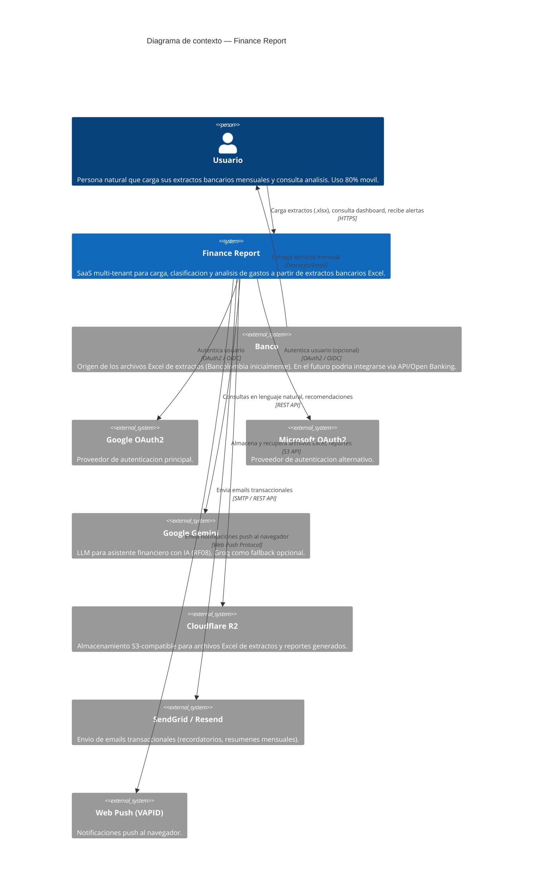
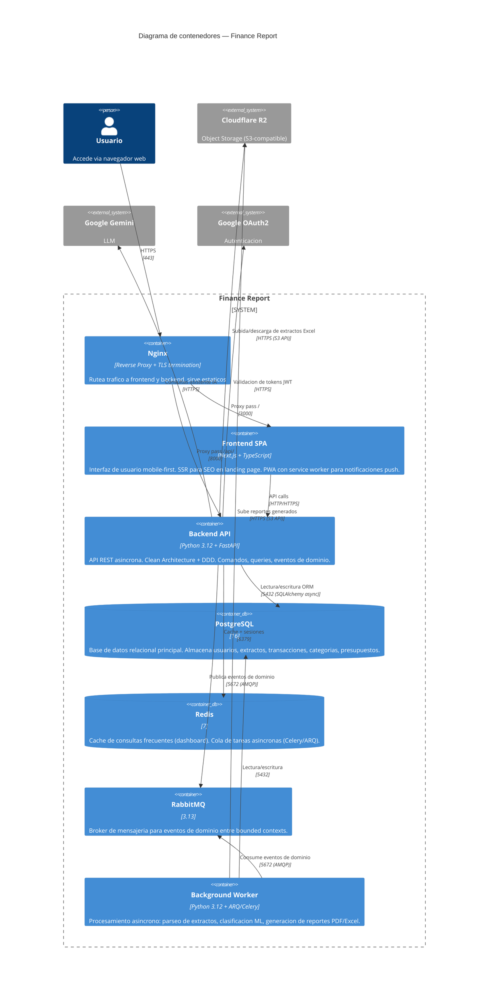

# Arquitectura del Sistema Finance Report

> Ultima actualizacion: 2026-07-04
> Version: 1.0.0

## 1. Proposito y alcance

Finance Report es un **SaaS multi-tenant** para carga, clasificacion y analisis de gastos personales a partir de extractos bancarios en formato Excel (.xlsx). El sistema permite a usuarios cargar sus extractos mensuales de tarjetas de credito, clasificar automaticamente las transacciones por categoria, y obtener analitica financiera avanzada mediante dashboards interactivos, deteccion de habitos financieros y un asistente con IA.

### Alcance funcional (por fase)

| Fase | Features | Estado |
|------|----------|--------|
| MVP (feat-001) | Scaffolding, estructura base Clean Architecture + DDD, API REST, modelo de datos, parser de extractos Bancolombia | Completada |
| feat-002 | Identificacion de tarjeta desde extracto (banco + ultimos 4 digitos), find-or-create en flujo de carga | Completada |
| feat-003 | Prevencion de extractos duplicados: validacion pre-flight, respuesta 409 Conflict | En progreso (analisis) |
| Roadmap | Clasificacion de gastos (RF02), Dashboard (RF03), Habitos financieros (RF04), Presupuestos (RF05), Asistente IA (RF08) | Pendiente |

### Alcance tecnico

- **Backend**: API REST asincrona con FastAPI, siguiendo Clean Architecture + Domain-Driven Design
- **Frontend**: SPA con Next.js (React), mobile-first con diseño responsivo
- **Infraestructura**: Contenedores Docker, orquestacion con Docker Compose (dev), CI/CD con GitHub Actions
- **Multi-banco**: Arquitectura preparada para soportar extractos de multiples bancos (Bancolombia inicialmente). Estrategia de parser configurable por banco.

---

## 2. Diagrama de contexto (C4 — Nivel 1)



---

## 3. Diagrama de contenedores (C4 — Nivel 2)



---

## 4. Topologia de servicios

El sistema sigue una arquitectura **modular monolith** con bounded contexts bien delimitados, preparada para evolucionar a microservicios cuando la escala lo demande.

### 4.1 Modulos del backend (Clean Architecture)

```
src/backend/
├── src/
│   ├── api/                    # Capa de presentacion (FastAPI routers, middlewares, DI)
│   │   ├── main.py             # Entrypoint, configuracion de FastAPI
│   │   ├── routes/
│   │   │   ├── extracts.py     # POST /api/v1/extracts/upload
│   │   │   ├── transactions.py
│   │   │   ├── dashboard.py
│   │   │   └── auth.py
│   │   ├── middleware/
│   │   │   ├── tenant.py       # Multi-tenant (extraccion de tenant_id)
│   │   │   ├── error_handler.py
│   │   │   └── observability.py
│   │   └── dependencies.py     # FastAPI DI (repos, servicios)
│   │
│   ├── application/            # Capa de aplicacion (casos de uso, comandos, queries)
│   │   ├── extracts/
│   │   │   ├── commands.py     # CargarExtracto, ReemplazarExtracto
│   │   │   ├── queries.py      # ObtenerExtractos, ConsultarEstadoCarga
│   │   │   └── handlers.py     # Orquestacion de comandos
│   │   ├── tarjetas/
│   │   │   └── commands.py     # IdentificarTarjeta (feat-002)
│   │   └── eventos.py          # Publicadores de eventos de dominio
│   │
│   ├── domain/                 # Capa de dominio (entidades, VOs, eventos, repos interfaces)
│   │   ├── extracto/
│   │   │   ├── entities.py     # Extracto (AggregateRoot)
│   │   │   ├── value_objects.py # PeriodoFacturacion, ArchivoR2Key
│   │   │   ├── eventos.py      # ExtractoCreado, ExtractoDuplicadoDetectado
│   │   │   ├── exceptions.py   # ExtractoDuplicadoException
│   │   │   └── repository.py   # ExtractoRepository (interfaz)
│   │   ├── tarjeta/
│   │   │   ├── entities.py     # Tarjeta
│   │   │   └── repository.py   # TarjetaRepository (interfaz)
│   │   ├── transaccion/
│   │   │   └── entities.py     # Transaccion
│   │   └── categoria/
│   │       └── entities.py     # Categoria
│   │
│   ├── infrastructure/         # Capa de infraestructura (implementaciones concretas)
│   │   ├── persistence/
│   │   │   ├── models.py       # SQLAlchemy ORM models
│   │   │   ├── repositories/   # Implementaciones de repositorios
│   │   │   └── unit_of_work.py
│   │   ├── storage/
│   │   │   └── r2_client.py    # Cliente S3 para Cloudflare R2
│   │   ├── parsing/
│   │   │   ├── bancolombia.py  # Parser especifico de extractos Bancolombia
│   │   │   └── base.py         # Interfaz base para parsers (multi-banco)
│   │   ├── llm/
│   │   │   └── gemini_client.py
│   │   ├── auth/
│   │   │   └── oauth2.py       # Google OAuth2, Microsoft OAuth2, JWT
│   │   ├── messaging/
│   │   │   └── rabbitmq.py     # Publicador/consumidor de eventos
│   │   └── observability/
│   │       ├── logging.py      # Configuracion structlog/logging
│   │       ├── metrics.py      # Prometheus metrics
│   │       └── tracing.py      # OpenTelemetry tracing
│   │
│   └── shared/                 # Kernel compartido
│       ├── base_entity.py      # AggregateRoot, Entity, ValueObject base
│       ├── domain_event.py     # DomainEvent base
│       └── exceptions.py       # DomainException base
│
├── tests/
│   ├── unit/
│   │   ├── domain/
│   │   ├── application/
│   │   └── infrastructure/
│   ├── integration/
│   │   ├── api/
│   │   └── persistence/
│   └── features/               # BDD (pytest-bdd)
│       └── extracto/
│           └── upload_extracto.feature
│
├── alembic/                    # Migraciones de base de datos
├── alembic.ini
├── requirements.txt
├── pyproject.toml
└── Dockerfile
```

### 4.2 Bounded Contexts

| Bounded Context | Responsabilidad | Agregados |
|-----------------|-----------------|-----------|
| **Carga de Extractos** | Subida, parseo, validacion y persistencia de extractos bancarios | Extracto (Aggregate Root), Tarjeta, Transaccion |
| **Clasificacion** (roadmap) | Categorizacion automatica y manual de transacciones, aprendizaje por correccion | Transaccion, Categoria, ReglaClasificacion |
| **Dashboard** (roadmap) | Agregacion y visualizacion de datos financieros | — (contexto de lectura/query) |
| **Habitos** (roadmap) | Deteccion de patrones, alertas, score de salud financiera | Alerta, Habito |
| **Presupuestos** (roadmap) | Definicion y seguimiento de presupuestos por categoria | Presupuesto |
| **Notificaciones** (roadmap) | Envio de push/email, recordatorios de pago, alertas | Notificacion |
| **Identidad y Auth** | Autenticacion OAuth2, gestion de tokens JWT, multi-tenant | Usuario, Tenant |

### 4.3 Comunicacion entre bounded contexts

- **Sincrona (mismo bounded context)**: Llamadas directas en memoria (Clean Architecture)
- **Asincrona (entre bounded contexts)**: Eventos de dominio publicados en RabbitMQ
- **Integracion**: Patron event-driven. Cada bounded context publica eventos de dominio que otros contextos pueden consumir.

```
┌──────────────┐    ExtractoCreado     ┌──────────────┐
│   Carga      │ ────────────────────► │ Clasificacion│
│   Extractos  │                       │              │
└──────┬───────┘                       └──────┬───────┘
       │                                      │
       │ ExtractoCreado                TransaccionClasificada
       │                                      │
       ▼                                      ▼
┌──────────────┐                       ┌──────────────┐
│  Dashboard   │◄──────────────────────│   Habitos    │
│              │   DatosAgregados      │              │
└──────────────┘                       └──────────────┘
```

---

## 5. Stack tecnologico

> **Importante**: Esta tabla es la fuente unica de verdad para el stack tecnologico. Todos los agentes subsiguientes (`design`, `scaffold`, `develop`, `test`, `quality`, `deploy`) leen esta seccion para adaptar su comportamiento.

| Capa | Tecnologia | Version | Justificacion |
|------|-----------|---------|---------------|
| Lenguaje | Python | 3.12+ | Seleccionado por el equipo. Ecosistema maduro para data processing, parsing y ML. |
| Runtime | CPython | 3.12+ | Runtime estandar, compatible con todas las dependencias del ecosistema. |
| Framework Backend | FastAPI | | Framework async de alto rendimiento para APIs REST. Validacion automatica con Pydantic, OpenAPI/Swagger integrado, soporte nativo para dependency injection. |
| Framework Frontend | Next.js | | Framework React full-stack. SSR para SEO en landing page, SSG para paginas estaticas, API routes para BFF. Mobile-first con diseño responsivo. |
| Lenguaje Frontend | TypeScript | | Tipado estatico para frontend, mejor mantenibilidad y DX que JavaScript puro. |
| ORM | SQLAlchemy | 2.0+ | ORM asincrono con soporte nativo para async/await. Mapeo de modelos de dominio a tablas PostgreSQL. Migraciones con Alembic. |
| Base de datos | PostgreSQL | 16 | Base de datos relacional con soporte robusto para JSON, window functions para analitica, constraints de unicidad, y extensiones PostGIS (futuro). |
| Almacenamiento | Cloudflare R2 | | Almacenamiento S3-compatible para archivos Excel de extractos. Zero egress fees, mas economico que AWS S3 para cargas frecuentes de lectura. |
| Cache | Redis | 7 | Cache de consultas de dashboard (IDistributedCache-like). Backend para colas de tareas asincronas (ARQ/Celery). |
| Mensajeria | RabbitMQ | 3.13 | Broker AMQP para eventos de dominio entre bounded contexts. Gestionado via libreria pika o aio-pika. Amplia adopcion, confiable. |
| Migraciones | Alembic | | Herramienta de migraciones para SQLAlchemy. Versionado de esquema de base de datos. |
| Background Jobs | ARQ / Celery | | Procesamiento asincrono: parseo de extractos, clasificacion ML, generacion de reportes. Redis como backend de colas. |
| Testing | pytest + pytest-bdd | | Framework de testing estandar en el ecosistema Python. pytest-bdd para criterios de aceptacion en Gherkin. pytest-asyncio para tests asincronos. |
| Mocking | pytest-mock + factory_boy | | Fixtures de fabrica para datos de prueba realistas. |
| Logging | structlog | | Logging estructurado con salida JSON. Facil integracion con OpenTelemetry y agregadores de logs (Loki, ELK). |
| Contenedores | Docker | | Multi-stage builds. Imagenes separadas para backend (FastAPI), frontend (Next.js), y worker (ARQ/Celery). |
| Orquestacion | Docker Compose | | Orquestacion local para desarrollo. Servicios: backend, frontend, postgres, redis, rabbitmq. |
| CI/CD | GitHub Actions | | Integracion nativa con repositorio GitHub. Pipelines para linting, testing, build, y deploy. |
| Observabilidad | OpenTelemetry + Prometheus + Grafana | | Stack estandar CNCF. Tracing distribuido (OTLP), metricas (Prometheus), dashboards (Grafana). |
| LLM / IA | Google Gemini (gemini-1.5-flash) | | Asistente financiero con IA (RF08). Groq como fallback opcional. Bajo costo, alta disponibilidad. |
| Auth | OAuth2 (Google + Microsoft) + JWT | | Autenticacion federada con proveedores externos. Tokens JWT para sesiones stateless. 2FA opcional via TOTP. |
| Email | Resend / SendGrid | | Envio de emails transaccionales: recordatorios de pago, resumenes mensuales. |
| Push Notifications | Web Push (VAPID) | | Notificaciones push al navegador. Service worker en el frontend para recepcion. |

---

## 6. ADR — Architecture Decision Records

### ADR-001: Stack tecnologico para Finance Report

- **Estado**: Aceptado
- **Fecha**: 2026-07-04
- **Contexto**:

  Se requiere definir el stack tecnologico completo para Finance Report, un SaaS multi-tenant de carga y analisis de extractos bancarios. El sistema involucra:
  - Procesamiento de archivos Excel (parsing, validacion)
  - API REST asincrona con Clean Architecture + DDD
  - Frontend SPA mobile-first
  - Componente de IA para asistente financiero
  - Procesamiento asincrono (clasificacion ML, generacion de reportes)
  - Almacenamiento de archivos (extractos Excel, reportes PDF/Excel)

  El proyecto ya existia con features completadas (feat-001: scaffolding, feat-002: identificacion de tarjeta) usando el stack definido en la fase de diseno inicial.

- **Decision**:

  Se adopta el siguiente stack tecnologico completo:

  **Backend**:
  - Python 3.12+ con FastAPI como framework API (async, alto rendimiento)
  - SQLAlchemy 2.0+ como ORM asincrono con Alembic para migraciones
  - Clean Architecture + Domain-Driven Design como patron arquitectonico
  - PostgreSQL 16 como base de datos relacional principal
  - RabbitMQ 3.13 como broker de mensajeria para eventos de dominio
  - ARQ/Celery con Redis como backend para procesamiento asincrono

  **Frontend**:
  - Next.js con TypeScript para SPA mobile-first
  - PWA con service worker para notificaciones push

  **Infraestructura y DevOps**:
  - Docker con multi-stage builds
  - Docker Compose para orquestacion en desarrollo
  - Cloudflare R2 como almacenamiento S3-compatible de archivos
  - GitHub Actions para CI/CD
  - OpenTelemetry + Prometheus + Grafana para observabilidad

  **Integraciones externas**:
  - Google Gemini como LLM principal para asistente IA
  - OAuth2 (Google + Microsoft) para autenticacion federada
  - Resend/SendGrid para emails transaccionales

- **Justificacion**:

  - **Python/FastAPI**: Elegido sobre TypeScript/Node.js y C#/.NET por el ecosistema superior en data processing/parsing (pandas, openpyxl), ML/NLP para clasificacion de transacciones y asistente IA, y productividad del desarrollador (Pydantic, async nativo). FastAPI ofrece rendimiento comparable a Node.js con mejor soporte para validacion automatica de schemas.
  - **SQLAlchemy 2.0+**: ORM maduro con soporte async nativo en su version 2.0, mejor integracion con PostgreSQL que alternativas como Prisma (que prioriza TypeScript).
  - **Clean Architecture + DDD**: Separacion clara de concerns, testeabilidad, y alineacion con el lenguaje ubicuo del dominio financiero. Los bounded contexts permiten evolucionar a microservicios en el futuro.
  - **PostgreSQL 16**: Soporte robusto para constraints de unicidad (critico para deduplicacion feat-003), window functions para analitica financiera, y extensiones como PostGIS si se requiere en el futuro.
  - **Cloudflare R2**: Zero egress fees — critico para un SaaS donde los usuarios descargan frecuentemente sus reportes. API S3-compatible facilita la migracion futura a AWS S3 si fuera necesario.
  - **RabbitMQ**: Mas ligero y simple que Kafka para el volumen actual de eventos de dominio. Amplia adopcion y tooling en el ecosistema Python.
  - **Next.js + TypeScript**: SSR para SEO en landing page, SSG para paginas estaticas, API routes para BFF si se necesita. TypeScript proporciona tipado estatico y mejor DX que JavaScript.
  - **Docker Compose**: Adecuado para la fase actual de desarrollo. Se considerara Kubernetes cuando se necesite orquestacion en produccion multi-nodo.

- **Alternativas consideradas**:
  - TypeScript/Node.js (Next.js full-stack) — Descartado: ecosistema de data processing/ML inferior a Python.
  - C#/.NET — Descartado: el equipo y las features implementadas ya estan en Python.
  - Kafka en vez de RabbitMQ — Descartado: overkill para el volumen actual de eventos. RabbitMQ es mas simple de operar.
  - MongoDB en vez de PostgreSQL — Descartado: los datos son altamente relacionales (extractos, transacciones, categorias, usuarios).
  - AWS S3 en vez de Cloudflare R2 — Descartado: costos de egress mas altos para descarga frecuente de reportes.

- **Consecuencias**:
  - **Positivas**:
    - Ecosistema Python optimo para procesamiento de archivos Excel y ML/NLP
    - Clean Architecture permite evolucionar modulos a microservicios cuando sea necesario
    - Docker Compose simplifica el desarrollo local y el onboarding de nuevos desarrolladores
    - R2 reduce costos operativos de almacenamiento y descarga
  - **Negativas**:
    - Dos lenguajes en el stack (Python backend + TypeScript frontend) aumenta la carga cognitiva
    - SQLAlchemy async requiere cuidado con lazy loading y session management
    - Docker Compose no escala a produccion multi-nodo (requiere migrar a Kubernetes en el futuro)
  - **Riesgos**:
    - El volumen de eventos de dominio podria superar la capacidad de RabbitMQ si el sistema crece significativamente
    - La dependencia de Google Gemini requiere un plan de contingencia si la API cambia o se depreca

---

### ADR-002: Patron arquitectonico — Clean Architecture + Domain-Driven Design

- **Estado**: Aceptado
- **Fecha**: 2026-07-04
- **Contexto**:

  Finance Report es un sistema con un dominio financiero rico: reglas de negocio complejas (validacion de unicidad de extractos, clasificacion de transacciones, deteccion de patrones de gasto), multiples bounded contexts (carga de extractos, clasificacion, dashboard, habitos, presupuestos), y un lenguaje ubicuo bien definido (extracto, periodo de facturacion, transaccion, cuota, abono, categoria).

  El sistema necesita ser:
  - **Testeable**: Las reglas de negocio deben ser verificables sin infraestructura externa.
  - **Mantenible**: El dominio evolucionara con nuevas reglas (ej. soporte para nuevos bancos, nuevos tipos de transaccion).
  - **Modular**: Cada bounded context debe poder evolucionar independientemente.
  - **Preparado para escalar**: La arquitectura debe permitir extraer bounded contexts como microservicios en el futuro.

- **Decision**:

  Se adopta **Clean Architecture** como patron arquitectonico principal, combinado con principios tacticos de **Domain-Driven Design**:

  - **Capas de Clean Architecture**:

    | Capa | Responsabilidad | Dependencias |
    |------|-----------------|--------------|
    | **Domain** | Entidades, Value Objects, Agregados, Eventos de dominio, Interfaces de repositorio | Ninguna (capa mas interna) |
    | **Application** | Casos de uso (comandos, queries, handlers), Orquestacion, DTOs | Domain |
    | **Infrastructure** | Persistencia (SQLAlchemy), Storage (R2), Parsing (Bancolombia), Auth (OAuth2), Mensajeria (RabbitMQ), LLM (Gemini) | Domain, Application |
    | **API** | Routers FastAPI, Middlewares, Dependency Injection, Serializacion/Deserializacion | Application, Infrastructure |

  - **Principios tacticos de DDD**:
    - **Agregados**: Extracto como Aggregate Root para el bounded context de Carga de Extractos
    - **Value Objects**: PeriodoFacturacion, ArchivoR2Key, DetallesTarjeta (inmutables, sin identidad)
    - **Domain Events**: ExtractoCreado, ExtractoDuplicadoDetectado, TransaccionClasificada
    - **Repositorios**: Interfaces en Domain, implementaciones en Infrastructure (patron Repository)
    - **Bounded Contexts**: Separacion logica con eventos de dominio como mecanismo de integracion

- **Justificacion**:

  - **Clean Architecture sobre Vertical Slices**: Vertical Slices mezcla logica de negocio con infraestructura, lo que dificulta la separacion de concerns en un dominio financiero con reglas complejas. Clean Architecture aísla el dominio, facilitando el testing unitario y la evolucion de la infraestructura sin afectar la logica de negocio.
  - **DDD sobre CRUD simple**: El dominio financiero tiene reglas ricas (BN-01 a BN-10) que no se pueden modelar como simple CRUD. DDD proporciona el lenguaje y los patrones para capturar esta complejidad.
  - **Modular Monolith sobre Microservicios desde el inicio**: Los microservicios introducen complejidad operativa (red, consistencia eventual, distributed tracing) que no se justifica en la fase actual. Clean Architecture con bounded contexts permite extraer modulos a microservicios cuando la escala lo demande.

- **Consecuencias**:
  - **Positivas**:
    - Dominio aislado y testeable: las reglas de negocio se prueban sin base de datos ni HTTP
    - Evolucion independiente de bounded contexts via eventos de dominio
    - Preparado para extraer modulos como microservicios (strangler fig pattern)
  - **Negativas**:
    - Mayor cantidad de archivos y capas comparado con arquitecturas mas planas (Vertical Slices, Fat Models)
    - Curva de aprendizaje para desarrolladores sin experiencia en DDD
    - Overhead de mapeo entre capas (entidades de dominio ↔ modelos ORM ↔ DTOs)

---

### ADR-003: Estrategia de autenticacion — OAuth2 federado con JWT stateless

- **Estado**: Aceptado
- **Fecha**: 2026-07-04
- **Contexto**:

  Finance Report es un SaaS multi-tenant que requiere autenticacion de usuarios. Los requerimientos (RF no funcionales, seccion 4 de requirements.md) especifican: OAuth2 con Google/Microsoft, 2FA opcional (TOTP), y encriptacion de datos financieros (AES-256 en reposo, TLS 1.3 en transito).

  Considerando que los usuarios acceden principalmente desde movil (80%), la solucion debe ser frictionless y no requerir credenciales adicionales.

- **Decision**:

  Se adopta autenticacion federada via OAuth2 con Google (principal) y Microsoft (alternativo), complementada con tokens JWT stateless para sesiones de API:

  - **Autenticacion**: Google OAuth2 como proveedor principal, Microsoft OAuth2 como opcion secundaria
  - **Autorizacion**: JWT (HS256 en desarrollo, RS256 en produccion) con claims: `sub`, `tenant_id`, `email`, `exp`, `iat`
  - **Sesiones**: Stateless. Access token (30 min) + Refresh token (30 dias)
  - **2FA**: Opcional via TOTP (RFC 6238)
  - **Encriptacion**: AES-256 para datos financieros en reposo, TLS 1.3 en transito

- **Consecuencias**:
  - Reduccion de friccion en onboarding (los usuarios ya tienen cuenta de Google)
  - Sin responsabilidad de almacenar/rotar passwords
  - JWT stateless simplifica la escalabilidad horizontal (no sticky sessions)
  - Dependencia externa: indisponibilidad de Google OAuth2 bloquea el login

---

## 7. Patrones transversales

### 7.1 Autenticacion y autorizacion

```
Cliente ──► GET /api/v1/auth/login/google ──► FastAPI ──► Google OAuth2
                                                     ◄── token ID
           ◄── JWT (access + refresh) ──── FastAPI

Cliente ──► GET /api/v1/extracts
           Authorization: Bearer <JWT> ──► Middleware ──► Verifica JWT
                                           TenantMiddleware ──► Extrae tenant_id
```

- **Flujo**: OAuth2 Authorization Code Grant con PKCE
- **Tokens**: JWT firmado, stateless. Access token (30 min), Refresh token (30 dias)
- **Middleware**: `TenantMiddleware` extrae `tenant_id` del JWT y lo inyecta en el contexto de la request
- **Encriptacion de datos financieros**: AES-256-GCM. Clave por tenant almacenada en vault (futuro: HashiCorp Vault o AWS KMS)

### 7.2 Comunicacion entre servicios (sync/async)

- **Sincrona**: REST sobre HTTP/1.1 entre frontend y backend. FastAPI routers en el mismo proceso para bounded contexts.
- **Asincrona**: RabbitMQ (AMQP 0-9-1) para eventos de dominio entre bounded contexts.
  - **Publicacion**: Capa de aplicacion publica eventos tras operaciones exitosas
  - **Consumo**: Workers (ARQ/Celery) o suscriptores en otros bounded contexts
  - **Garantia de entrega**: At-least-once. Idempotency keys en consumidores.

### 7.3 Manejo de errores y resiliencia

- **Errores de dominio**: `DomainException` con codigos de error semanticos (ej. `EXTRACTO_DUPLICADO`)
- **Mapeo a HTTP**: Middleware global captura `DomainException` y mapea a status codes:
  - `ExtractoDuplicadoException` → 409 Conflict
  - `TarjetaNoEncontradaException` → 404 Not Found
  - `ValidacionFallidaException` → 422 Unprocessable Entity
- **Circuit Breaker**: (futuro) patron circuit breaker para llamadas a servicios externos (Gemini, R2, OAuth2)
- **Retry**: Backoff exponencial con jitter para operaciones idempotentes (subida a R2)
- **Safety net**: Constraints de base de datos como ultima linea de defensa ante race conditions (ej. `uq_extracto_tarjeta_periodo`)

### 7.4 Logging y observabilidad

- **Logging estructurado**: `structlog` con salida JSON. Campos estandar:
  - `timestamp`, `level`, `logger`, `message`
  - `tenant_id`, `user_id`, `correlation_id` (trazabilidad)
  - `event_type` (para eventos de dominio)
- **Tracing**: OpenTelemetry auto-instrumentation para FastAPI, SQLAlchemy, Redis, RabbitMQ
  - Propagation de `trace_id` y `span_id` via headers HTTP y headers AMQP
- **Metricas**: Prometheus metrics endpoint (`/metrics`)
  - Contadores: `extractos_cargados_total`, `extractos_duplicados_total`, `transacciones_clasificadas_total`
  - Histogramas: `carga_extracto_duracion_segundos`, `parseo_excel_duracion_segundos`
  - Gauges: `extractos_por_procesar`, `cola_eventos_tamano`
- **Health checks**: Endpoint `/health` con checks de:
  - PostgreSQL connectivity (`SELECT 1`)
  - Redis connectivity (`PING`)
  - RabbitMQ connectivity
  - R2 connectivity (head bucket)

### 7.5 Estrategia de testing

| Nivel | Herramienta | Alcance | Cobertura esperada |
|-------|------------|--------|-------------------|
| **Unitarios** | pytest + pytest-mock | Capa de dominio (entidades, VOs, reglas de negocio) | > 90% |
| **Integracion** | pytest + TestContainers (postgres) | Repositorios, casos de uso, handlers | > 80% |
| **API (e2e)** | pytest + httpx (TestClient de FastAPI) | Endpoints REST, middlewares, serializacion | Happy paths + edge cases |
| **Aceptacion (BDD)** | pytest-bdd (Gherkin) | Criterios de aceptacion definidos en features | Un .feature por caso de uso |
| **Frontend** | Vitest + React Testing Library | Componentes, hooks, servicios, paginas | > 80% |

- **TDD**: Ciclo RED-GREEN-REFACTOR obligatorio para nueva funcionalidad (skill `tdd`)
- **BDD**: Criterios de aceptacion en Gherkin antes de implementar (skill `bdd`)
- **CI**: Tests unitarios + integracion en cada push. BDD en cada PR hacia `develop`.

---

## 8. Restricciones tecnicas

| Restriccion | Descripcion | Fundamento |
|-------------|-------------|------------|
| **Multi-tenant** | Todos los datos se particionan por `tenant_id`. Queries siempre filtradas. | Aislamiento de datos entre tenants. Preparado para futura facturacion por tenant. |
| **Nunca almacenar numero completo de tarjeta** | Solo se almacenan los ultimos 4 digitos. El numero enmascarado del extracto (****7681) se extrae pero no se persiste completo. | Cumplimiento de seguridad (PCI-DSS). Requerimiento no funcional. |
| **Parseo configurable por banco** | Cada banco tiene su propia implementacion de parser. Interfaz comun `BaseParser` con metodo `parse(file: bytes) -> ExtractoParseado`. | Extensibilidad para soportar Davivienda, BBVA y otros bancos colombianos. |
| **Idempotencia de carga de extractos** | La operacion de carga debe ser idempotente: mismo archivo + mismo periodo = 409 Conflict. | BN-DUP-01, feat-003. Evita duplicados y gasto innecesario de recursos. |
| **Sin dependencia de sistema de archivos local** | Los archivos Excel se procesan en memoria o via streams. El unico almacenamiento persistente es R2. | Escalabilidad horizontal (stateless). Compatible con entornos efimeros (Kubernetes pods). |
| **TLS 1.3 en transito** | Toda comunicacion externa debe usar TLS 1.3 como minimo. | Requerimiento de seguridad. |
| **Health checks obligatorios** | Todo servicio debe exponer endpoint `/health` con checks de sus dependencias. | Orquestacion (Docker healthcheck, Kubernetes liveness/readiness probes). |

---

## 9. Roadmap arquitectonico

| Fase | Hito | Descripcion | Impacto arquitectonico |
|------|------|-------------|----------------------|
| **Actual** | feat-003 completado | Prevencion de extractos duplicados con respuesta 409 Conflict | Nuevo evento de dominio `ExtractoDuplicadoDetectado`. Safety net con constraint BD. |
| **Siguiente** | feat-004 | Reemplazo de extractos duplicados (BN-01: "ofrecer reemplazar el existente") | Optimizacion: mover subida a R2 despues del pre-flight check. |
| **Mediano plazo** | Clasificacion (RF02) | Motor de reglas + ML para categorizacion de transacciones | Nuevo bounded context `Clasificacion`. Evento `TransaccionClasificada`. Pipeline de ML (scikit-learn / spaCy). |
| **Mediano plazo** | Dashboard (RF03) | Graficos interactivos, KPIs financieros, drill-down | Contexto de lectura (CQRS). Vistas materializadas en PostgreSQL. Cache Redis. |
| **Largo plazo** | Multi-banco | Parsers para Davivienda, BBVA, y otros bancos colombianos | Nuevas implementaciones de `BaseParser`. Registro via factory pattern o plugin system. |
| **Largo plazo** | Escalamiento a microservicios | Extraer bounded contexts como servicios independientes | API Gateway (Kong/Traefik). Service mesh (Istio/Linkerd). Kubernetes en produccion. |
| **Largo plazo** | IA Assistant (RF08) | Chat con lenguaje natural, recomendaciones proactivas | Integracion Gemini + RAG con datos financieros del usuario. Streaming de respuestas (SSE). |
