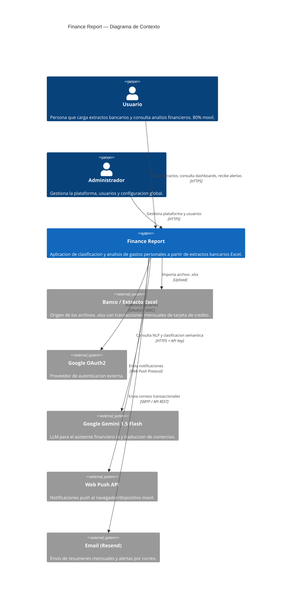
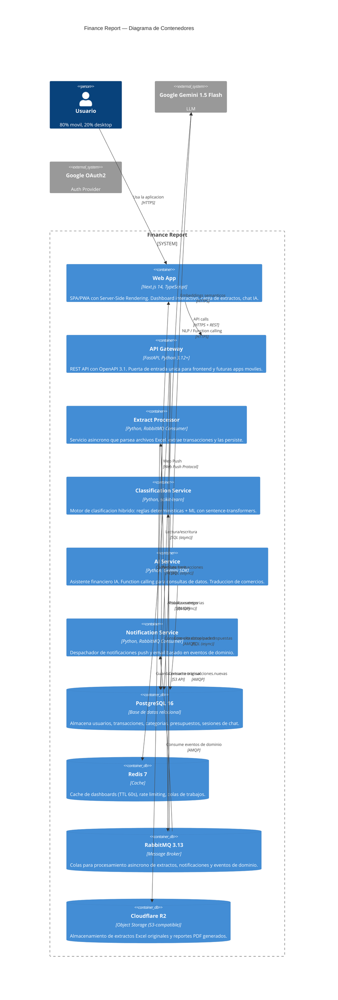
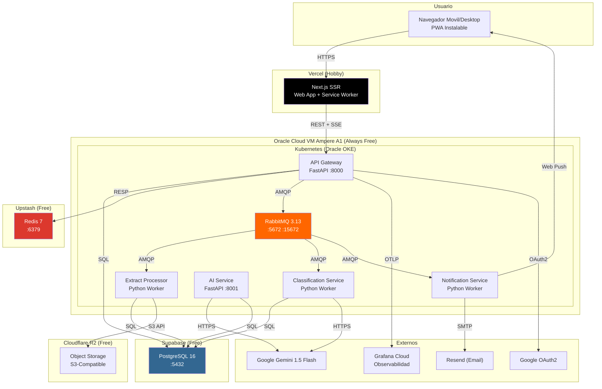

# Arquitectura del Sistema — Finance Report

> **Ultima actualizacion**: 2026-06-02
> **Version**: 1.0

---

## 1. Proposito y alcance

Finance Report es una aplicacion de **clasificacion y analisis de gastos personales** a partir de extractos bancarios en formato Excel (.xlsx). El sistema permite a usuarios en Colombia (y eventualmente otros paises hispanohablantes) cargar sus extractos de tarjeta de credito, clasificar automaticamente cada transaccion en categorias predefinidas o personalizadas, y visualizar dashboards interactivos con KPIs financieros, deteccion de malos habitos, presupuestos, metas de ahorro, y un asistente IA en espanol.

**Alcance funcional**:
- Carga y parseo inteligente de extractos bancarios Excel (multi-banco)
- Clasificacion hibrida de transacciones (reglas deterministicas + ML)
- Dashboards con graficos interactivos (donut, barras, lineas, treemap, heatmap, proyeccion de cuotas)
- Deteccion automatica de malos habitos financieros (8 tipos de alertas)
- Presupuestos por categoria y metas de ahorro
- Asistente financiero con IA (chat en lenguaje natural)
- Traduccion colaborativa de nombres de comercios
- Soporte multi-moneda inteligente (COP + USD + monedas extranjeras)
- Notificaciones push/email y recordatorios de pago

---

## 2. Diagrama de contexto (C4 — Nivel 1)



---

## 3. Diagrama de contenedores (C4 — Nivel 2)



---

## 4. Topologia de servicios

| # | Contenedor | Tipo | Puerto | Replicas | Recursos |
|---|-----------|------|--------|----------|----------|
| 1 | **WebApp** | Next.js SSR | 3000 | 1-2 | 1 OCPU, 2GB RAM (Oracle VM) |
| 2 | **APIGateway** | FastAPI (ASGI) | 8000 | 2-4 | 1 OCPU, 2GB RAM c/u |
| 3 | **PostgreSQL** | Database | 5432 | 1 (HA opcional) | Supabase free: 500MB |
| 4 | **Redis** | Cache | 6379 | 1 | Upstash free: 256MB |
| 5 | **RabbitMQ** | Message Broker | 5672, 15672 | 1 | 1 OCPU, 2GB RAM |
| 6 | **ExtractProcessor** | Python Worker | — | 1-3 | 1 OCPU, 2GB RAM c/u |
| 7 | **ClassificationService** | Python Worker | — | 1-2 | 1 OCPU, 2GB RAM c/u |
| 8 | **AIService** | Python Worker/API | 8001 | 1-2 | 1 OCPU, 2GB RAM c/u |
| 9 | **NotificationService** | Python Worker | — | 1 | 1 OCPU, 1GB RAM |
| 10 | **ObjectStorage** | Cloudflare R2 | — | N/A | 10GB free |

**Colas RabbitMQ**:

| Cola | Consumidor | Prioridad | DLQ |
|------|-----------|-----------|-----|
| `extract.uploaded` | ExtractProcessor | Alta | `extract.dlq` |
| `transactions.new` | ClassificationService | Media | `transactions.dlq` |
| `notifications.send` | NotificationService | Baja | `notifications.dlq` |

---

## 5. Stack tecnologico

| Capa | Tecnologia | Version | Justificacion |
|------|-----------|---------|---------------|
| Lenguaje backend | Python | 3.12+ | Mejor ecosistema para Excel (openpyxl/pandas) y ML (scikit-learn/sentence-transformers) |
| Framework API | FastAPI | latest | Alto rendimiento async, OpenAPI automatico, validacion Pydantic v2 |
| Lenguaje frontend | TypeScript | 5.x | Type safety, mejor DX que JavaScript puro |
| Framework frontend | Next.js (App Router) | 14+ | SSR/SSG, PWA-ready, optimizado para Vercel |
| ORM | SQLAlchemy 2.0 + Alembic | latest | ORM maduro con async/await, migraciones robustas |
| Base de datos | PostgreSQL 16 | 16 | NUMERIC para precision financiera, 500MB free en Supabase |
| Cache | Redis 7 | 7 | Cache de dashboards 60s TTL, 256MB free en Upstash |
| Mensajeria | RabbitMQ | 3.13 | Auto-gestionado en Oracle VM, 3 colas + DLQ |
| LLM | Google Gemini 1.5 Flash | latest | 1,500 req/dia gratis, mejor espanol + function calling |
| Excel parsing | openpyxl + pandas | latest | Parseo robusto de estructuras complejas multi-banco |
| ML | scikit-learn + sentence-transformers | latest | Embeddings semanticos de nombres de comercio |
| Testing backend | pytest + pytest-asyncio | latest | Async testing nativo, fixtures potentes |
| Testing frontend | Vitest | latest | Rapido, compatible con Vite/Next.js |
| Logging backend | structlog | latest | Logging estructurado, integracion OpenTelemetry |
| Logging frontend | Winston | latest | Logging estandar en Node.js |
| Contenedores | Docker | latest | Containerizacion estandar |
| Orquestacion | Kubernetes (Oracle OKE) | latest | Managed K8s con nodos ARM gratuitos |
| CI/CD | GitHub Actions | — | 2,000 min/mes free, integracion nativa |
| Observabilidad | OpenTelemetry + Grafana Cloud | latest | 10K metricas free, 50GB logs, 14d retencion |
| Almacenamiento | Cloudflare R2 (S3-compatible) | — | 10GB free, sin egress fees |
| Despliegue frontend | Vercel | Hobby | 100GB bandwidth, deploy automatico, previews por rama |
| Despliegue backend | Oracle Cloud VM Ampere A1 | Always Free | 4 OCPU ARM, 24GB RAM, 200GB disco |

---

## 6. ADR — Architecture Decision Records

### ADR-001: Clean Architecture con separacion en capas
**Estado**: Aceptado
**Fecha**: 2026-06-02
**Contexto**: El sistema necesita una arquitectura mantenible, testeable y que permita evolucionar independientemente las capas de dominio, aplicacion, infraestructura y presentacion.
**Decision**: Adoptar Clean Architecture con 4 capas estrictamente separadas: Dominio (entidades, value objects, interfaces), Aplicacion (casos de uso, DTOs, servicios de aplicacion), Infraestructura (persistencia, mensajeria, servicios externos), y Presentacion (API REST, Web App). Las dependencias solo apuntan hacia adentro (Dominio no depende de nada externo).
**Consecuencias**:
- Positivas: Alta testeabilidad (dominio sin dependencias), facilidad para cambiar infraestructura (ej. cambiar PostgreSQL por otro motor), desacoplamiento claro.
- Negativas: Mayor cantidad de archivos/proyectos iniciales, curva de aprendizaje para desarrolladores nuevos, posible sobre-ingenieria para casos de uso simples.

### ADR-002: Arquitectura cloud-native con auto-scaling para picos dia 1-5 del mes
**Estado**: Aceptado
**Fecha**: 2026-06-02
**Contexto**: El 80% de las cargas de extractos ocurren en los primeros 5 dias del mes (fechas de corte). El sistema debe escalar automaticamente en esos picos y reducirse el resto del mes para minimizar costos.
**Decision**: Desplegar en Kubernetes (Oracle OKE) con HorizontalPodAutoscaler basado en CPU y longitud de cola RabbitMQ. Configurar minReplicas=1 y maxReplicas=4 para servicios de procesamiento. Usar Oracle Cloud Always Free (4 OCPU ARM, 24GB RAM) como unico nodo worker, con posibilidad de escalar a nodos adicionales bajo demanda.
**Consecuencias**:
- Positivas: Costo $0/mes en infraestructura base, escalado automatico en picos, alta disponibilidad.
- Negativas: Complejidad operativa de Kubernetes, limitacion a 4 OCPU en free tier (puede ser insuficiente con muchos usuarios), vendor lock-in moderado con Oracle Cloud.

### ADR-003: Motor de clasificacion hibrido (reglas deterministicas + ML para aprendizaje)
**Estado**: Aceptado
**Fecha**: 2026-06-02
**Contexto**: Las transacciones bancarias tienen nombres de comercio no amigables (ej. "DLO*DIDI FOOD CO PAYIN"). Se necesita un motor de clasificacion preciso que mejore con el tiempo mediante aprendizaje de correcciones del usuario.
**Decision**: Implementar un motor hibrido en dos fases: (1) Reglas deterministicas con palabras clave y expresiones regulares para clasificacion inicial (~80% precision), (2) ML con sentence-transformers para embeddings semanticos de nombres de comercio, re-clasificando basado en similitud coseno con correcciones previas del usuario. La confianza se calcula como umbral de similitud: alta (>0.9), media (0.7-0.9), baja (<0.7).
**Consecuencias**:
- Positivas: Alta precision inicial con reglas, mejora continua con feedback del usuario, bajo costo computacional (modelos pre-entrenados).
- Negativas: Complejidad de mantener dos subsistemas de clasificacion, necesidad de re-entrenar embeddings periodicamente, latencia adicional por llamada a Gemini para embeddings.

### ADR-004: Mobile-first responsive design (80% uso movil)
**Estado**: Aceptado
**Fecha**: 2026-06-02
**Contexto**: El 80% de las consultas y cargas se realizaran desde dispositivos moviles. Los dashboards deben ser completamente funcionales en pantallas pequenas.
**Decision**: Adoptar un enfoque mobile-first con Next.js App Router, Tailwind CSS para diseño responsive, y componentes optimizados para touch (graficos con Chart.js + react-chartjs-2). La web app se comporta como PWA (Progressive Web App) con soporte offline para consulta de datos cacheados, instalable en home screen, y Web Push API para notificaciones.
**Consecuencias**:
- Positivas: Experiencia nativa en movil sin necesidad de desarrollar apps separadas (iOS/Android), menor costo de desarrollo y mantenimiento, actualizaciones inmediatas.
- Negativas: Limitaciones de PWA en iOS (push notifications limitados), rendimiento de graficos complejos en dispositivos de gama baja, no disponible en App Store/Play Store.

### ADR-005: Procesamiento asincrono de extractos via RabbitMQ
**Estado**: Aceptado
**Fecha**: 2026-06-02
**Contexto**: El parseo de extractos Excel puede ser intensivo en CPU (archivos grandes, estructuras complejas multi-banco). No debe bloquear la respuesta HTTP al usuario.
**Decision**: El API Gateway acepta la carga del archivo, lo almacena en Cloudflare R2, publica un mensaje en la cola `extract.uploaded`, y retorna inmediatamente un `202 Accepted` con un `trackingId`. El ExtractProcessor consume el mensaje, parsea el Excel, persiste las transacciones, y publica `transactions.new` para el ClassificationService. El frontend sondea el estado via `GET /api/extracts/{trackingId}/status` o recibe un evento SSE cuando termina.
**Consecuencias**:
- Positivas: Respuesta inmediata al usuario, procesamiento desacoplado, reintentos automaticos via DLQ, escalado independiente del worker de parseo.
- Negativas: Complejidad de gestionar estados asincronos en el frontend, latencia adicional por el paso por RabbitMQ, necesidad de monitorear colas y DLQ.

### ADR-006: API-first design — REST API consumida por frontend y futura app movil
**Estado**: Aceptado
**Fecha**: 2026-06-02
**Contexto**: La aplicacion tendra inicialmente un frontend web (Next.js), pero en el futuro se preve una app movil nativa (React Native o Flutter). La API debe ser reutilizable por cualquier cliente.
**Decision**: Diseñar la API siguiendo el enfoque API-first: contratos OpenAPI 3.1 generados automaticamente por FastAPI, autenticacion via JWT (OAuth2 con Google), versionado en la URL (`/api/v1/...`), y HATEOAS minimo para descubrimiento de recursos. El frontend Next.js consume la API como un cliente mas, sin logica de negocio acoplada.
**Consecuencias**:
- Positivas: API reutilizable por cualquier cliente, documentacion automatica (Swagger UI + ReDoc), testing de contratos independiente, facilidad para onboardear nuevos desarrolladores.
- Negativas: Overhead de llamadas HTTP adicionales (no hay server-side data fetching directo desde Next.js a BD), latencia de red, necesidad de mantener backward compatibility.

### ADR-007: PostgreSQL para integridad de datos financieros
**Estado**: Aceptado
**Fecha**: 2026-06-02
**Contexto**: Los datos financieros requieren precision decimal exacta, integridad referencial, y consultas agregadas complejas (sumatorias, promedios, comparativas mes a mes). No se pueden permitir errores de redondeo.
**Decision**: Usar PostgreSQL 16 como base de datos principal. Aprovechar el tipo NUMERIC(precision, scale) para montos financieros, constraints CHECK para validar reglas de negocio (ej. montos no negativos en gastos), indices parciales para consultas frecuentes (transacciones por usuario + periodo), y window functions para calculos de tendencias y promedios moviles. Supabase como hosting (500MB free).
**Consecuencias**:
- Positivas: Precision decimal garantizada (a diferencia de FLOAT), integridad referencial estricta, ecosistema maduro de migraciones (Alembic), funciones de agregacion avanzadas.
- Negativas: Escalabilidad vertical limitada en Supabase free (500MB), no es tan flexible para datos no estructurados como MongoDB, requiere tuning de indices para dashboards complejos.

### ADR-008: Estrategia de branching Git Flow
**Estado**: Aceptado
**Fecha**: 2026-06-02
**Contexto**: El proyecto necesita una estrategia de branching clara que permita desarrollo paralelo de features, releases estables, y hotfixes rapidos.
**Decision**: Adoptar Git Flow con ramas: `main` (produccion), `develop` (integracion), `feature/{id}-{slug}` (desarrollo de features), `release/{version}` (preparacion de releases), `hotfix/{id}-{slug}` (correcciones urgentes). Cada feature se desarrolla en su propia rama y se integra via Pull Request a `develop` con revision de codigo.
**Consecuencias**:
- Positivas: Flujo de trabajo predecible, separacion clara entre desarrollo y produccion, facilidad para hotfixes, compatible con GitHub Actions y Vercel previews.
- Negativas: Overhead de gestion de ramas para equipos pequeños, posibles conflictos de merge frecuentes en `develop`, latencia entre merge y despliegue.

### ADR-009: Stack tecnologico (Python/FastAPI + TypeScript/Next.js, infra $0/mes)
**Estado**: Aceptado
**Fecha**: 2026-06-02
**Contexto**: Se requiere definir el stack tecnologico completo que equilibre productividad del desarrollador, ecosistema adecuado para el dominio (Excel, ML, NLP en espanol), y costo de infraestructura cercano a $0/mes para un MVP bootstrapped.
**Decision**: Backend en Python 3.12+ con FastAPI (mejor ecosistema para openpyxl/pandas y ML). Frontend en TypeScript con Next.js 14+ (SSR/SSG, PWA, deploy gratuito en Vercel Hobby). PostgreSQL 16 en Supabase (500MB free). Redis 7 en Upstash (256MB free). RabbitMQ auto-gestionado en Oracle Cloud VM Ampere A1 (4 OCPU, 24GB RAM, Always Free). Google Gemini 1.5 Flash como LLM (1,500 req/dia gratis). Cloudflare R2 para almacenamiento (10GB free, sin egress). Observabilidad con Grafana Cloud free tier.
**Consecuencias**:
- Positivas: Costo de infraestructura $0/mes para MVP y baja escala (<100 usuarios activos), ecosistema Python lider en data science y Excel parsing, Next.js + Vercel ofrecen el mejor DX para frontend con deploy automatico, PostgreSQL garantiza integridad de datos financieros.
- Negativas: Stack heterogeneo (Python + TypeScript) requiere desarrolladores full-stack o dos perfiles, Oracle Cloud Always Free tiene limitaciones (ARM, recursos compartidos, sin SLA), Supabase free tier solo 500MB (requiere migracion al crecer), RabbitMQ auto-gestionado requiere mantenimiento operativo.

---

## 7. Patrones transversales

### Autenticacion y autorizacion

- **OAuth2 / OIDC** con Google como proveedor unico inicial. Flujo Authorization Code + PKCE.
- **JWT** (access token + refresh token). Access token 15min TTL, refresh token 7 dias (rotacion incluida).
- **Roles**: `user` (default), `admin` (gestion de plataforma).
- **2FA opcional** via TOTP (a implementar en v1.1).
- Middleware de autenticacion en API Gateway que valida JWT en cada request.
- CSRF protection via SameSite=Strict cookies + token en header.

### Comunicacion entre servicios (sync/async)

```
Cliente ──HTTPS/REST──▶ API Gateway ──SQL──▶ PostgreSQL
                            │                   
                            ├──AMQP──▶ RabbitMQ ──▶ ExtractProcessor ──▶ PostgreSQL
                            │                         ClassificationService ──▶ PostgreSQL  
                            │                         NotificationService
                            │
                            ├──HTTPS──▶ AIService ──▶ Gemini API
                            │
                            └──SSE◀── (streaming de eventos al frontend)
```

- **Sincrono**: REST entre WebApp y API Gateway, API Gateway y AIService. SQL directo desde API Gateway a PostgreSQL.
- **Asincrono**: RabbitMQ para procesamiento de extractos, clasificacion, y notificaciones.
- **Streaming**: Server-Sent Events (SSE) para progreso de carga de extractos y notificaciones en tiempo real.
- **Web Push**: NotificationService → navegador para alertas push.

### Manejo de errores y resiliencia

- **Circuit Breaker** con `tenacity` en llamadas a servicios externos (Gemini, email).
- **Retry con backoff exponencial** en consumidores RabbitMQ (max 3 reintentos, luego DLQ).
- **Problem Details (RFC 7807)** para respuestas de error en API Gateway.
- **Correlation ID** propagado en todas las capas (header `X-Correlation-ID`).
- **Graceful degradation**: si el servicio de IA no esta disponible, el chat muestra mensaje de indisponibilidad pero el resto de la app funciona.
- **Health checks**: `/health` (liveness) y `/health/ready` (readiness) en todos los servicios.

### Logging y observabilidad

- **Logging estructurado**: `structlog` en backend, `Winston` en frontend. Formato JSON con campos: timestamp, level, logger, correlation_id, user_id, message, extra.
- **Trazabilidad distribuida**: OpenTelemetry SDK con propagacion de contexto via W3C Trace Context.
- **Metricas**: Prometheus metrics expuestas en `/metrics` (contadores de requests, latencia, tasa de errores, transacciones procesadas).
- **Dashboards**: Grafana Cloud con dashboards predefinidos para salud de servicios, trafico API, y metricas de negocio (cargas por dia, precision de clasificacion).
- **Alertas**: Configuradas en Grafana Cloud para errores 5xx > 5%, latencia p99 > 2s, y colas DLQ con mensajes acumulados.

### Estrategia de testing

| Nivel | Herramienta | Cobertura objetivo | Enfoque |
|-------|------------|-------------------|---------|
| **Unitario** | pytest + pytest-asyncio | > 80% dominio y aplicacion | TDD con ciclo RED-GREEN-REFACTOR. Una carpeta por clase, un archivo por metodo. |
| **Integracion** | pytest + TestContainers (PostgreSQL, Redis) | > 60% infraestructura | Probar repositorios, consumidores RabbitMQ, y servicios externos mockeados. |
| **Contract** | schema validation (OpenAPI) | API Gateway | Validar que respuestas cumplen el esquema OpenAPI. |
| **E2E** | Playwright | Smoke tests criticos | Flujos principales: login → cargar extracto → ver dashboard → clasificar transaccion. |
| **BDD** | pytest-bdd (Gherkin) | Criterios de aceptacion | Feature files para historias de usuario complejas (ej. deteccion de suscripciones fantasma). |

---

## 8. Restricciones tecnicas

| Categoria | Restriccion | Detalle |
|-----------|------------|---------|
| **Seguridad** | Encriptacion de datos en reposo | AES-256 para datos financieros. PostgreSQL TDE si el proveedor lo soporta. |
| **Seguridad** | Encriptacion en transito | TLS 1.3 para todas las comunicaciones externas. mTLS para comunicaciones entre servicios en el cluster. |
| **Seguridad** | Datos de tarjeta | Solo almacenar ultimos 4 digitos del numero de tarjeta. NUNCA almacenar CVV, fecha de expiracion, ni PIN. |
| **Seguridad** | Cumplimiento de datos | Los datos financieros son de consumo personal. No se comparten con terceros sin consentimiento explicito del usuario. |
| **Rendimiento** | Carga de extracto | < 3 segundos para archivo de ~150 filas (parseo sincrono inicial). Procesamiento asincrono total < 10 segundos. |
| **Rendimiento** | Dashboard | < 1 segundo para carga inicial de KPIs y graficos. Usar Redis cache con TTL de 60s. |
| **Rendimiento** | Clasificacion automatica | < 500ms para clasificar ~70 transacciones. |
| **Escalabilidad** | Picos de uso | Soportar 10x trafico en dias 1-5 del mes sin degradacion. Auto-scaling via HPA en Kubernetes. |
| **Escalabilidad** | Usuarios concurrentes | Soportar 50 usuarios simultaneos en MVP, 500+ en v1.0. |
| **Portabilidad** | Multi-banco | El sistema debe soportar extractos de al menos 3 bancos colombianos (Bancolombia, Davivienda, BBVA) con diferentes formatos de Excel. |
| **Portabilidad** | Migracion de datos | Exportacion/importacion de datos historicos en formato estandar (CSV, JSON) para cambio de banco/tarjeta. |
| **Usabilidad** | Mobile-first | UI responsive con diseño adaptativo. PWA instalable. Touch-friendly en graficos. |
| **Usabilidad** | Onboarding | Tutorial interactivo con extracto de ejemplo precargado. No requiere registro para demo. |
| **Internacionalizacion** | i18n | Inicialmente espanol (es-CO, es-MX, es-AR). Preparado para ingles (en-US) y portugues (pt-BR) en v2.0. |
| **Disponibilidad** | Uptime | 99.5% (max 3.65h downtime/mes). La carga de extractos es critica 1 vez al mes por usuario. |

---

## 9. Contratos API

### Resumen de endpoints por recurso

| Recurso | Metodos | Endpoints principales | Descripcion |
|---------|---------|----------------------|-------------|
| **Auth** | POST | `/api/v1/auth/login`, `/api/v1/auth/refresh`, `/api/v1/auth/logout` | Autenticacion OAuth2 con Google. Manejo de tokens JWT. |
| **Usuarios** | GET, PATCH, DELETE | `/api/v1/users/me`, `/api/v1/users/me/preferences` | Perfil del usuario autenticado, preferencias de notificacion y configuracion. |
| **Tarjetas** | GET, POST, PATCH, DELETE | `/api/v1/cards`, `/api/v1/cards/{id}` | Gestion de tarjetas de credito asociadas al usuario. Ultimos 4 digitos, alias, banco. |
| **Extractos** | POST, GET, DELETE | `/api/v1/extracts/upload`, `/api/v1/extracts`, `/api/v1/extracts/{id}`, `/api/v1/extracts/{id}/status` | Carga y consulta de extractos. Status para tracking asincrono. |
| **Transacciones** | GET, PATCH | `/api/v1/transactions`, `/api/v1/transactions/{id}`, `/api/v1/transactions/batch-classify` | Listado paginado con filtros (periodo, categoria, comercio). Clasificacion individual y masiva. |
| **Categorias** | GET, POST, PATCH, DELETE | `/api/v1/categories`, `/api/v1/categories/{id}`, `/api/v1/categories/{id}/subcategories` | Categorias predefinidas y personalizadas del usuario. Subcategorias anidadas. |
| **Dashboards** | GET | `/api/v1/dashboards/summary`, `/api/v1/dashboards/by-category`, `/api/v1/dashboards/daily`, `/api/v1/dashboards/monthly-trend`, `/api/v1/dashboards/treemap`, `/api/v1/dashboards/installments-projection`, `/api/v1/dashboards/heatmap` | Endpoints de datos agregados para cada visualizacion. Cache con Redis (60s TTL). |
| **Presupuestos** | GET, POST, PATCH, DELETE | `/api/v1/budgets`, `/api/v1/budgets/{id}`, `/api/v1/budgets/{id}/progress` | Presupuestos por categoria. Calculo de progreso en tiempo real. |
| **Metas de ahorro** | GET, POST, PATCH, DELETE | `/api/v1/savings-goals`, `/api/v1/savings-goals/{id}`, `/api/v1/savings-goals/{id}/projection` | Metas de ahorro con proyeccion de fecha de cumplimiento. |
| **Alertas & Insights** | GET, PATCH | `/api/v1/insights`, `/api/v1/insights/{id}/dismiss`, `/api/v1/insights/health-score` | Alertas de malos habitos detectadas. Score de salud financiera. |
| **Asistente IA** | POST, GET | `/api/v1/chat/sessions`, `/api/v1/chat/sessions/{id}/messages` (SSE disponible) | Sesiones de chat con el asistente financiero IA. Soporta streaming de respuestas via SSE. |
| **Comercios** | GET, POST | `/api/v1/merchants/translate`, `/api/v1/merchants/suggest` | Traduccion de nombres de comercio. Sugerencias colaborativas. |
| **Reportes** | POST, GET | `/api/v1/reports/generate`, `/api/v1/reports/{id}/download` | Generacion asincrona de reportes PDF/Excel. Descarga cuando estan listos. |
| **Notificaciones** | GET, PATCH | `/api/v1/notifications`, `/api/v1/notifications/{id}/read`, `/api/v1/notifications/preferences` | Bandeja de notificaciones. Preferencias de canal (push/email). |

### Ejemplo de contrato: Carga de extracto

```
POST /api/v1/extracts/upload
Content-Type: multipart/form-data
Authorization: Bearer <JWT>

Body:
  file: extracto_mayo_2026.xlsx
  card_id: "card_abc123"

Response 202:
{
  "tracking_id": "ext_track_xyz789",
  "status": "processing",
  "status_url": "/api/v1/extracts/ext_track_xyz789/status",
  "estimated_seconds": 5
}
```

### Ejemplo de contrato: Dashboard summary

```
GET /api/v1/dashboards/summary?card_id=card_abc123&period=2026-05
Authorization: Bearer <JWT>

Response 200:
{
  "period": {"start": "2026-05-15", "end": "2026-05-18", "cutoff_date": "2026-05-18"},
  "kpis": {
    "total_spent_cop": 8543500.00,
    "total_income": 1200000.00,
    "avg_daily_spent": 284783.33,
    "cupo_utilization_pct": 42.7,
    "days_until_cutoff": 16,
    "variation_vs_previous_month_pct": -8.3
  },
  "previous_period_kpis": { ... }
}
```

---

## 10. Modelo de datos conceptual

### Entidades principales (13 entidades)

```
┌─────────────────────────────────────────────────────────────────────────────┐
│                           FINANCE REPORT — MODELO DE DATOS                   │
└─────────────────────────────────────────────────────────────────────────────┘

┌──────────────┐       ┌──────────────┐       ┌──────────────┐
│   Usuario    │1─────*│   Tarjeta    │1─────*│  Extracto    │
│              │       │              │       │              │
│ id           │       │ id           │       │ id           │
│ email        │       │ last_4_digits│       │ periodo_start│
│ name         │       │ alias        │       │ periodo_end  │
│ avatar_url   │       │ bank_name    │       │ cutoff_date  │
│ preferences  │       │ cupo_total   │       │ due_date     │
│ created_at   │       │ created_at   │       │ pago_total   │
│ updated_at   │       │ updated_at   │       │ pago_minimo  │
└──────────────┘       └──────────────┘       │ cupo_total   │
       │                                       │ cupo_dispon  │
       │                                       │ status       │
       │                                       │ created_at   │
       │                                       └──────┬───────┘
       │                                              │1
       │                                              │
       │                                              *│
       │                                       ┌──────┴───────┐
       │                                       │ Transaccion  │
       │                                       │              │
       │                                       │ id           │
       │                                       │ auth_number  │
       │                                       │ date         │
       │                                       │ description  │
       │                                       │ amount_cop   │
       │                                       │ amount_orig  │
       │                                       │ currency_orig│
       │                                       │ cuotas_total │
       │                                       │ cuota_actual │
       │                                       │ cuota_valor  │
       │                                       │ interes_mens │
       │                                       │ interes_anual│
       │                                       │ saldo_pend   │
       │                                       │ is_installment│
       │                                       │ confidence   │
       │                                       └──────┬───────┘
       │                                              │*
       │                                              │
       │                                     ┌────────┴────────┐
       │                              ┌──────┴───────┐  ┌──────┴──────┐
       │                              │   Categoria  │  │ Subcategoria│
       │                              │              │  │              │
       │                              │ id           │  │ id           │
       │                              │ name         │  │ name         │
       │                              │ icon         │  │ categoria_id │
       │                              │ color        │  │ created_at   │
       │                              │ is_default   │  └──────────────┘
       │                              │ user_id (FK) │
       │                              │ created_at   │
       │                              └──────────────┘
       │
       │       ┌──────────────┐       ┌──────────────┐
       │       │ Presupuesto  │       │ MetaAhorro   │
       │       │              │       │              │
       │       │ id           │       │ id           │
       │       │ categoria_id │       │ name         │
       │       │ monto_limite │       │ target_amount│
       │       │ periodo      │       │ current_amount│
       │       │ user_id (FK) │       │ target_date  │
       │       │ created_at   │       │ user_id (FK) │
       │       │ updated_at   │       │ created_at   │
       │       └──────────────┘       └──────────────┘
       │
       │       ┌──────────────┐       ┌──────────────────┐
       │       │Traduccion    │       │  Notificacion    │
       │       │Comercio      │       │                  │
       │       │              │       │ id               │
       │       │ id           │       │ user_id          │
       │       │ original_name│       │ type             │
       │       │ translated   │       │ title            │
       │       │ confidence   │       │ body             │
       │       │ is_approved  │       │ data (JSON)      │
       │       │ suggested_by │       │ is_read          │
       │       │ created_at   │       │ channel          │
       │       └──────────────┘       │ created_at       │
       │                              └──────────────────┘
       │
       │       ┌──────────────────┐    ┌──────────────────┐
       │       │ SesionChat       │    │ MensajeChat      │
       │       │                  │    │                  │
       │       │ id               │    │ id               │
       │       │ user_id          │    │ sesion_id        │
       │       │ title            │    │ role (user/ai)   │
       │       │ created_at       │    │ content          │
       │       │ updated_at       │    │ chart_data (JSON)│
       │       └──────────────────┘    │ created_at       │
       │                               └──────────────────┘
       │
       │       ┌──────────────────────┐
       │       │ NotificacionPrefer   │
       │       │                      │
       │       │ id                   │
       │       │ user_id              │
       │       │ payment_reminder     │
       │       │ large_transaction    │
       │       │ weekly_summary       │
       │       │ budget_alert         │
       │       │ habit_alert          │
       │       │ cutoff_reminder      │
       │       │ monthly_summary      │
       │       └──────────────────────┘
       │
       ▼
    (Relaciones no mostradas por claridad)
```

### Relaciones clave

| Origen | Destino | Cardinalidad | Descripcion |
|--------|---------|-------------|-------------|
| Usuario | Tarjeta | 1:N | Un usuario puede tener multiples tarjetas |
| Tarjeta | Extracto | 1:N | Una tarjeta tiene un extracto por periodo |
| Extracto | Transaccion | 1:N | Un extracto contiene N transacciones |
| Transaccion | Categoria | N:1 | Cada transaccion pertenece a una categoria |
| Categoria | Subcategoria | 1:N | Una categoria tiene multiples subcategorias |
| Transaccion | Subcategoria | N:1 | Cada transaccion puede tener subcategoria (nullable) |
| Usuario | Presupuesto | 1:N | Presupuestos personalizados por usuario |
| Usuario | MetaAhorro | 1:N | Metas de ahorro por usuario |
| Usuario | SesionChat | 1:N | Historial de sesiones del asistente IA |
| SesionChat | MensajeChat | 1:N | Mensajes dentro de una sesion de chat |
| Usuario | TraduccionComercio | 1:N | Sugerencias de traduccion por usuario |
| Usuario | Notificacion | 1:N | Notificaciones recibidas por el usuario |
| Usuario | NotificacionPreferencia | 1:1 | Preferencias de notificacion por usuario |

---

## 11. Patrones de integracion

### REST sincrono (API Gateway ↔ WebApp)

- Contratos definidos en OpenAPI 3.1, generados automaticamente por FastAPI.
- Autenticacion via `Authorization: Bearer <JWT>` en cada request.
- Rate limiting: 100 req/min por usuario, 20 req/min en endpoints de escritura.
- Paginacion: cursor-based para listados de transacciones (evita offset en datasets grandes).
- Versionado: `/api/v1/...` en URL.

### RabbitMQ asincrono (API Gateway → Workers)

| Evento | Publicador | Consumidor | Formato |
|--------|-----------|------------|---------|
| `extract.uploaded` | API Gateway | ExtractProcessor | `{ "tracking_id": "...", "file_key": "...", "card_id": "...", "user_id": "..." }` |
| `transactions.new` | ExtractProcessor | ClassificationService | `{ "extract_id": "...", "transaction_ids": [...], "user_id": "..." }` |
| `notification.send` | ClassificationService, API Gateway | NotificationService | `{ "user_id": "...", "type": "budget_alert", "title": "...", "body": "...", "data": {...} }` |
| `insight.detected` | ClassificationService | API Gateway (SSE relay) | `{ "user_id": "...", "insight_type": "subscription_ghost", "payload": {...} }` |

### SSE streaming (API Gateway → WebApp)

- Endpoint: `GET /api/v1/events/stream` (autenticado).
- Eventos: `extract.progress`, `insight.detected`, `notification.new`, `budget.threshold`.
- Formato: `text/event-stream` con campos `id`, `event`, `data`.
- Reconexion automatica con `Last-Event-ID`.

### Web Push (NotificationService → Navegador)

- NotificationService genera notificaciones push via Web Push API.
- El frontend registra un Service Worker que recibe y muestra notificaciones incluso con la app cerrada (PWA instalada).
- VAPID keys generadas por servidor, public key compartida con el frontend.

---

## 12. Roadmap arquitectonico

### Fase 1 — MVP (Junio 2026)
- [x] Definicion de arquitectura y stack tecnologico
- [x] ADRs fundacionales (9 ADRs aceptados)
- [ ] Scaffolding de monorepo (backend Python + frontend Next.js)
- [ ] API Gateway con endpoints core: auth, carga de extracto, CRUD transacciones
- [ ] Parseo de extracto Excel para formato Bancolombia
- [ ] Motor de clasificacion por reglas deterministicas (14 categorias)
- [ ] Dashboard basico: KPIs, donut por categoria, grafico de barras diario
- [ ] Infraestructura serverless en Oracle Cloud Always Free + Supabase + Vercel
- [ ] CI/CD con GitHub Actions
- [ ] PWA basica instalable

### Fase 2 — v1.0 (Julio 2026)
- [ ] Procesamiento asincrono completo con RabbitMQ
- [ ] Clasificacion hibrida con ML (sentence-transformers)
- [ ] Dashboards completos: treemap, heatmap, proyeccion de cuotas, tendencia mensual
- [ ] Presupuestos por categoria y metas de ahorro
- [ ] Alertas de malos habitos (todas las 8)
- [ ] Notificaciones push y email
- [ ] Traduccion de comercios colaborativa
- [ ] Asistente IA basico con Gemini (chat + function calling)
- [ ] Soporte multi-banco (Davivienda, BBVA)
- [ ] Exportacion de reportes PDF y Excel
- [ ] Onboarding con extracto de ejemplo

### Fase 3 — v1.1 (Agosto 2026)
- [ ] Simulador "que pasaria si"
- [ ] Score de salud financiera con historico
- [ ] Comparativa social anonimizada (benchmarking)
- [ ] 2FA via TOTP
- [ ] Multi-moneda avanzada (tasas de cambio historicas)
- [ ] App movil nativa (React Native) — fase inicial
- [ ] Webhooks para integracion con bancos (Open Banking)

### Fase 4 — v2.0 (Septiembre+ 2026)
- [ ] Soporte multi-idioma (ingles, portugues)
- [ ] Integracion directa con APIs bancarias (Open Banking Colombia)
- [ ] Recomendaciones de productos financieros (afiliacion)
- [ ] Modo colaborativo familiar (presupuesto compartido)
- [ ] Escalado horizontal a multi-region
- [ ] Migracion de Supabase a PostgreSQL dedicado (mayor capacidad)
- [ ] Certificacion de seguridad (ISO 27001, PCI DSS nivel basico)

---

## 13. Diagrama de despliegue (infraestructura)



---

## 14. Glosario de arquitectura

| Termino | Definicion |
|---------|-----------|
| **Clean Architecture** | Patron arquitectonico con capas concentricas donde el dominio es el centro y no depende de nada externo. |
| **ADR** | Architecture Decision Record. Documento que captura una decision arquitectonica importante, su contexto, y consecuencias. |
| **PWA** | Progressive Web App. Aplicacion web que se comporta como una app nativa (instalable, offline, push notifications). |
| **SSE** | Server-Sent Events. Tecnologia que permite al servidor enviar eventos en tiempo real al cliente sobre HTTP. |
| **AMQP** | Advanced Message Queuing Protocol. Protocolo usado por RabbitMQ para mensajeria asincrona. |
| **DLQ** | Dead Letter Queue. Cola donde se envian mensajes que no pudieron ser procesados tras N reintentos. |
| **HPA** | Horizontal Pod Autoscaler. Mecanismo de Kubernetes para escalar replicas basado en metricas. |
| **OTLP** | OpenTelemetry Protocol. Protocolo para enviar telemetria (traces, metrics, logs) a colectores. |
| **VAPID** | Voluntary Application Server Identification. Estandar para autenticar servidores de Web Push. |
| **JWT** | JSON Web Token. Token de autenticacion que transporta claims firmados digitalmente. |
| **TOTP** | Time-based One-Time Password. Algoritmo para generar codigos 2FA basados en tiempo. |
| **Function Calling** | Capacidad de LLMs para invocar funciones definidas por el desarrollador y usar sus resultados en la respuesta. |
| **Embeddings semanticos** | Representacion vectorial de texto que captura su significado semantico, permitiendo comparacion por similitud coseno. |
| **S3-compatible** | API de almacenamiento de objetos compatible con el estandar de Amazon S3. |
| **Always Free** | Tier gratuito de Oracle Cloud que incluye recursos de por vida (no solo periodo de prueba). |
